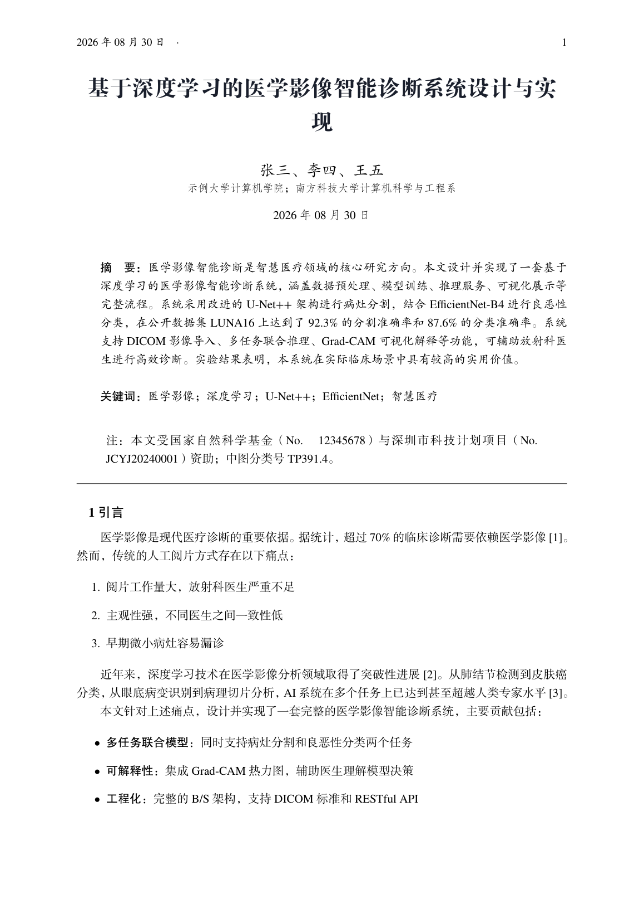
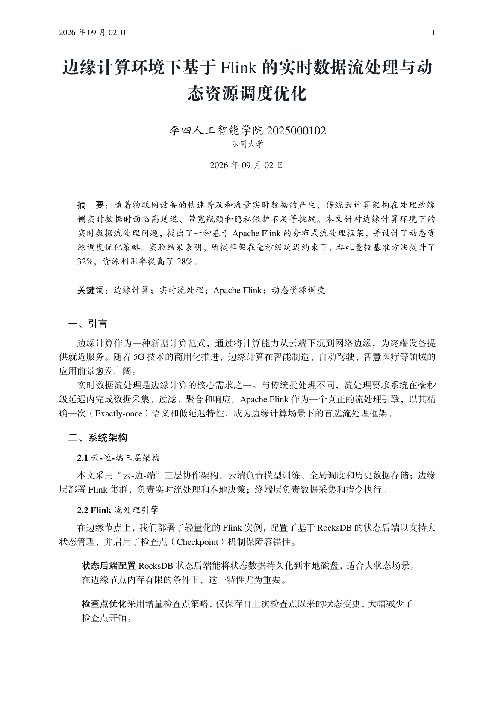
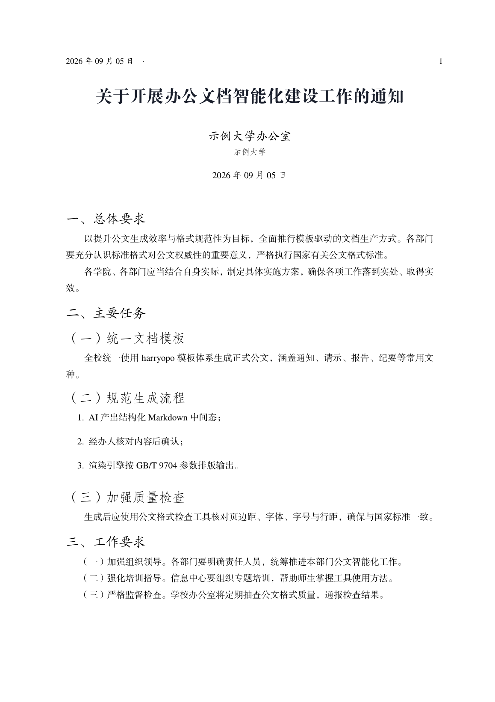
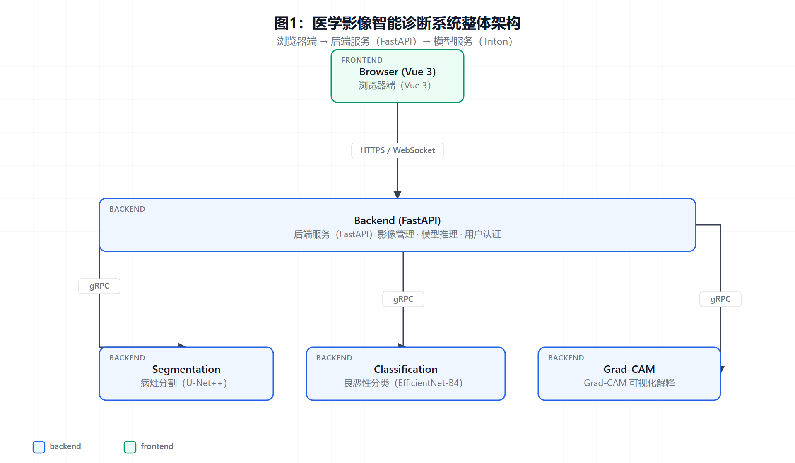
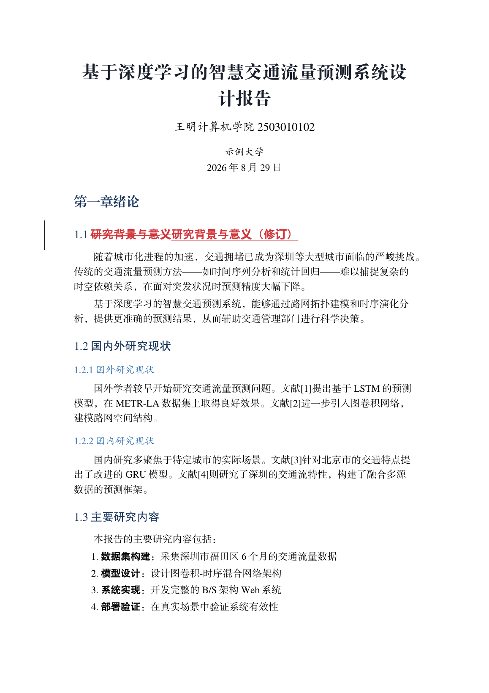

<div align="center">

# harryopo

**AI-native office document platform — standard-beautiful Word / LaTeX / PDF, generated by AI the right way**

*办公文档 AI 生产力平台：生成、互转、图表、修订留痕。*

[](https://www.python.org/)
[]()
[]()
[]()
[](README.md)

`AI produces structured data → template engines render faithfully` — never let an LLM emit .docx/.pdf binaries directly.

</div>

---

## 📸 Showcase

| Paper (single-column, full feature) | Paper (two-column) |
|:---:|:---:|
|  |  |
| **Report (chapters + auto-rendered diagrams)** | **Chinese official document (GB/T 9704)** |
|  |  |

| Architecture diagram (contract-driven, auto-rendered) | AI second draft with native tracked changes |
|:---:|:---:|
|  |  |

> One Markdown intermediate produces every format above; diagrams are rendered and inserted by the pipeline; every AI edit is recorded as native Word tracked changes.

## ✨ Features

- **📝 One Markdown, three outputs** — MD intermediate → official/academic .docx (native TOC + OMML equations + booktabs tables) + XeLaTeX PDF (FangZheng fonts + XITS Math) + LaTeX source
- **🔄 Conversion in every direction** — Word→PDF (COM export, WYSIWYG), LaTeX→Word (.tex→MD cleaning→dual renderers), scanned PDF→MD (MinerU layout-aware parsing)
- **🌐 Five-tier parsing router** — any document in, clean Markdown out:

  ```
  .doc (97-2003)  →  kreuzberg (Rust core, the only reliable legacy-format parser)
  .docx           →  anydoc (millisecond fast path) → pandoc → markitdown → python-docx backfill
  .pdf / images   →  MinerU (0.2s/page, OCR / formulas / colspan tables)
  20+ long-tail   →  markitdown (Microsoft official)
  ```

- **🖼️ Built-in diagram engine** — write a ` ```mermaid ` block or diagram-design spec in your MD; the pipeline renders PNG and inserts it with caption-below + note conventions. ASCII-art diagrams are blocked by a runtime guard.
- **✏️ Two-way revision tracking** — `redline` (what the user changed: diff two docx into a native redline draft) + `track_changes` (what the AI changed: second draft with native w:ins/w:del marks)
- **🏛️ GB/T 9704 official-document mode** — `--gov` applies the national standard layout (margins 37/35/28/26mm, size-3 FangSong body, 28pt leading, hierarchical heading fonts); `govcheck` runs a 10-item compliance audit
- **🔧 harryopo-build-mcp** — LaTeX compile-diagnosis loop as an MCP server: build → structured errors (code + line + fix suggestion) → fix → rebuild, plus a 7-item .tex static lint
- **🇨🇳 Chinese typography guard** — text_norm normalizes AI-generated half-width punctuation and CJK spacing, with code blocks / math / URLs protected

## 🚀 Quick Start

```bash
# 1) Dependencies (Windows + Python 3.10+)
pip install python-docx latex2mathml pywin32 markitdown kreuzberg playwright
python -m playwright install chromium          # diagram PNG rendering
# LaTeX: TinyTeX / TeX Live (xelatex + ctex)
# Optional: firecrawl-anydoc (fast docx parsing) / mineru[core] (scanned documents)

# 2) One command: Markdown → Word + PDF
python .trae/skills/harryopo-office/scripts/office.py render mydoc.md --format all

# 3) Official-document mode (GB/T 9704)
python .trae/skills/harryopo-office/scripts/office.py render notice.md --format paper --gov
python .trae/skills/harryopo-office/scripts/office.py govcheck notice-paper.tex

# 4) Diagrams: write them inline
#    ```mermaid
#    flowchart TD; A[Start] --> B{Condition}; B -->|yes| C[Do];
#    ```

# 5) Revision loop
python .trae/skills/harryopo-office/scripts/redline.py draft.docx user-edited.docx -o redline.docx
python .trae/skills/harryopo-office/scripts/word/track_changes.py draft.docx v2.docx \
    --rev '[{"op":"replace","find":"old","replace":"new"}]' --author "AI"
```

## 📦 The Skill Package

`harryopo-office` is a self-contained Agent Skill — drop `.trae/skills/harryopo-office/` into your AI coding tool's skill directory (Claude Code / Trae / any SKILL.md-aware agent):

```
harryopo-office/
├── SKILL.md                    # trigger words + the full document workflow + conventions
├── scripts/
│   ├── office.py               # unified entry: render / redline / govcheck / diagram / template
│   ├── convert.py              #   MD → LaTeX (incl. --gov official mode)
│   ├── word/md_to_word.py      #   MD → Word (OMML equations / booktabs / native TOC)
│   ├── word/track_changes.py   #   tracked-changes output (AI edit trail)
│   ├── redline.py              #   redline diff (user edit trail)
│   ├── mineru_cli.py           #   deep PDF/DOCX parsing (MinerU)
│   ├── latex_diagnostics.py    #   LaTeX diagnostics (log parsing + 7-item lint)
│   ├── build_mcp.py            #   harryopo-build-mcp (compile-diagnosis MCP server)
│   └── gb9704_check.py         #   official-document compliance audit
├── skills/diagram-design/      # editorial diagram specs (39 types)
└── templates/                  # self-contained LaTeX templates (cls + 19 fonts, no install)
```

**Recommended AI workflow** (solidified in SKILL.md):

```
request → ①AI writes MD intermediate → ②user reviews → ③diagram suggestion (multi-type choice)
        → ④diagram render + self-check → ⑤convention-aware insertion → ⑥render Word/PDF
        → ⑦user edits in Word → ⑧redline diff → ⑨AI applies intent as v2 (track_changes trail)
```

## 📚 Documentation

| Doc | Description |
|---|---|
| [SKILL.md](.trae/skills/harryopo-office/SKILL.md) | Full skill reference (triggers / workflow / conventions) |
| [Plan v3](docs/plans/2026-08-30-office-super-skill-v3.md) | Architecture & roadmap (P0/P1 fully shipped) |
| [Research](docs/research/) | Four rounds of open-source surveys (MCP / generation / Chinese docs / revisions) |
| [Examples](output/examples/README.md) | Regeneration commands for the six showcase documents |
| [CLAUDE.md](CLAUDE.md) | Agent rules + 40+ documented pitfalls |

## 🙏 Acknowledgements

Built on the shoulders of:

[anydoc](https://github.com/firecrawl/anydoc) (Firecrawl) · [MinerU](https://github.com/opendatalab/MinerU) · [markitdown](https://github.com/microsoft/markitdown) (Microsoft) · [kreuzberg](https://github.com/Goldziher/kreuzberg) · [Python-Redlines](https://github.com/JSv4/Python-Redlines) · [diagram-design](https://github.com/cathrynlavery/diagram-design) · [Mermaid](https://mermaid.js.org/) · [docxtpl](https://github.com/elapouya/python-docx-template) · [python-docx](https://github.com/python-openxml/python-docx) · [Pandoc](https://pandoc.org/) · [ctex](https://github.com/CTeX-org/ctex-kit) · [MCP](https://modelcontextprotocol.io/)

## ⚠️ Notes

- **Platform**: the Word pipeline requires Windows + local MS Office (COM); the LaTeX/PDF pipeline is cross-platform
- **Fonts**: FangZheng fonts are commercially licensed — for open-source use switch to `--config opensource` (system fonts)
- **Privacy**: personal data has been scrubbed from history and the repo

<div align="center">

**If this project helps you, please consider giving it a ⭐**

[中文文档](README.md)

</div>
