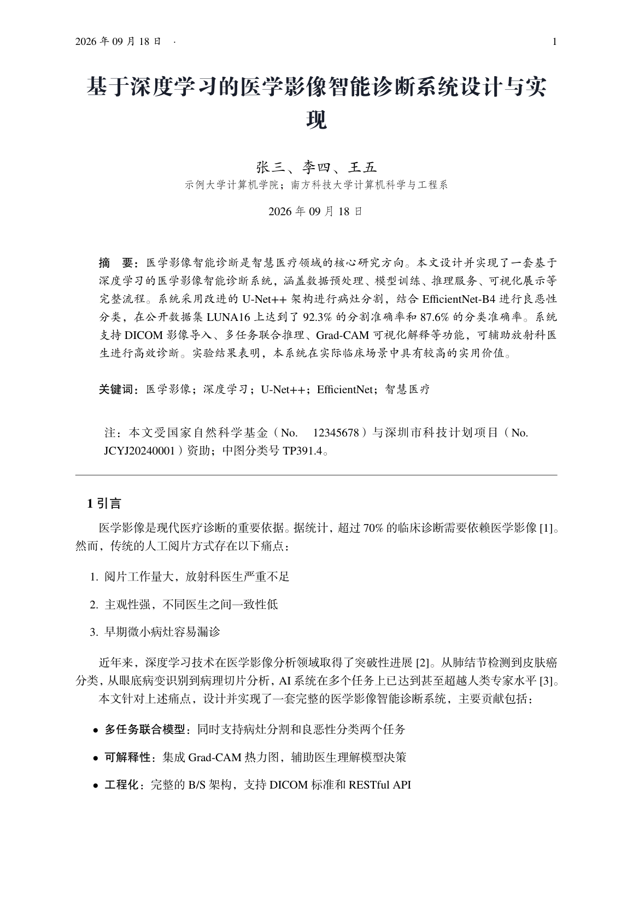
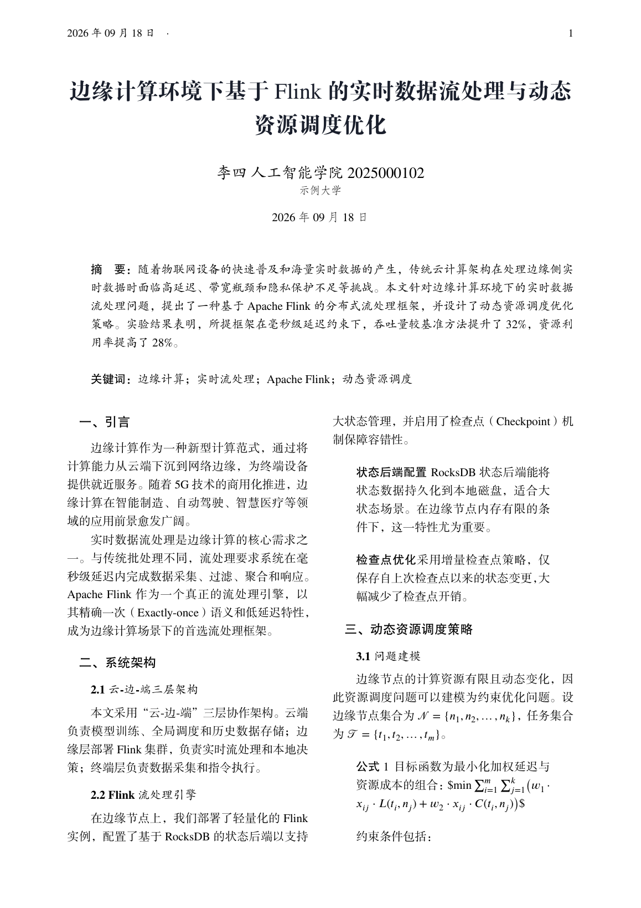
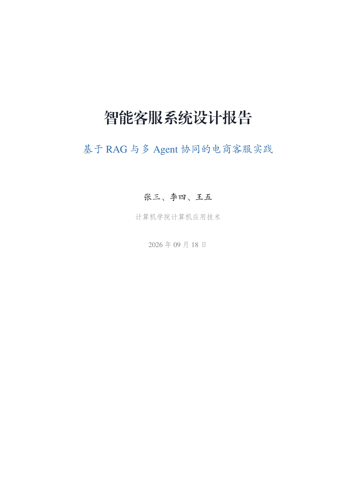
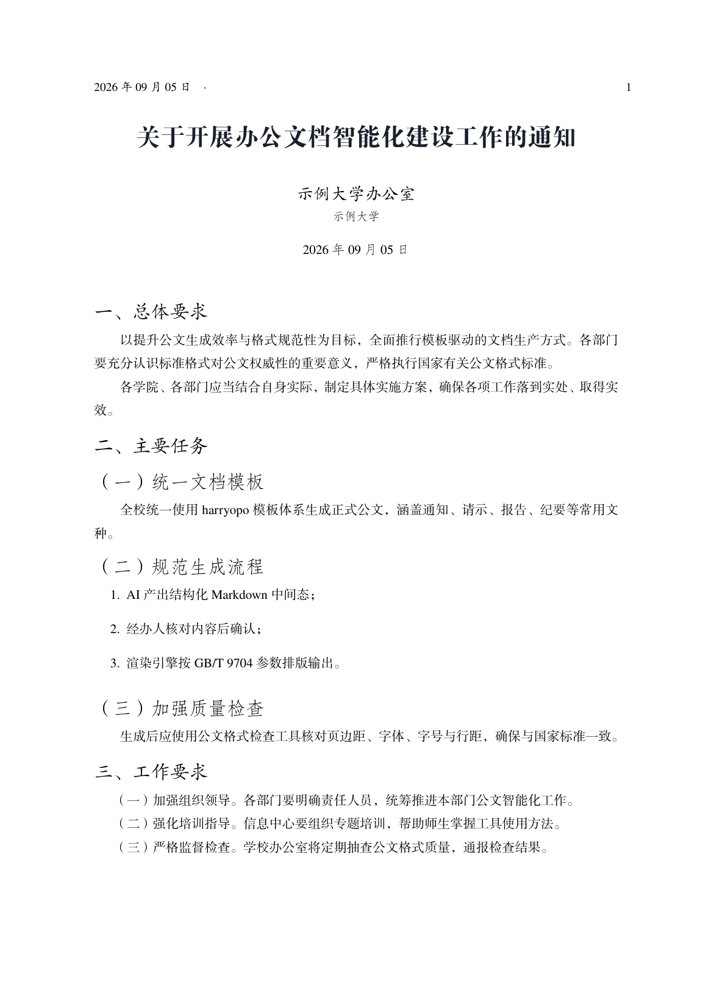
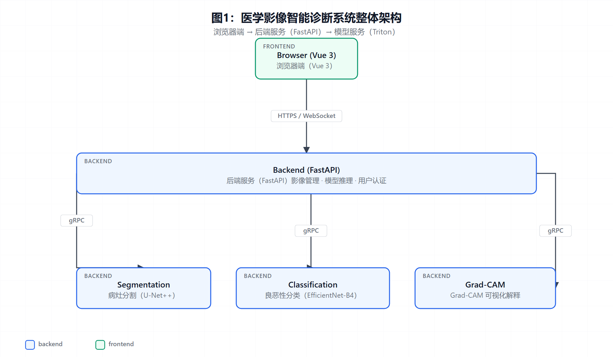
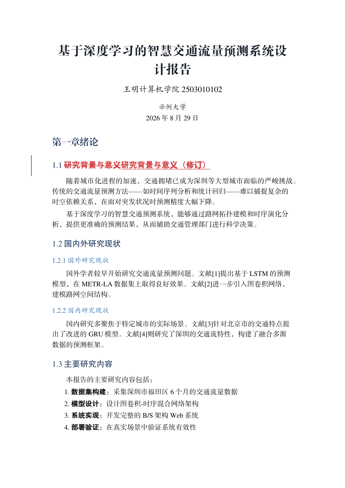

<div align="center">

# harryopo

**办公文档 AI 生产力平台 — 让 AI 产出标准美观的 Word / LaTeX / PDF**

*AI-native office document platform: standard-beautiful Word / LaTeX / PDF generation, conversion, diagrams and revision tracking.*

[](https://www.python.org/)
[]()
[]()
[]()
[](README.en.md)

`AI 只产出结构化数据 → 模板引擎保真渲染` — 绝不让 AI 直接生成 .docx/.pdf 二进制

</div>

---

## 📸 效果展示

| 论文（单栏全特性） | 论文（双栏） |
|:---:|:---:|
|  |  |
| **报告（章节式 + 架构图 + Mermaid）** | **GB/T 9704 公文模式** |
|  |  |

| 架构图（契约驱动自动渲染） | AI 二稿带原生修订标记 |
|:---:|:---:|
|  |  |

> 一份 Markdown 中间态，同时产出上面所有格式；图表在管线内自动渲染插入；AI 的每一次修改都以原生修订标记留痕。

## ✨ 功能特性

- **📝 一份 MD，三格式产出** — Markdown 中间态 → 公文/学术 .docx（原生目录 + OMML 公式 + 三线表）+ XeLaTeX PDF（方正字体 + XITS 数学）+ LaTeX 源码
- **🔄 全方向互转** — Word→PDF（COM 直导，100% 所见即所得）、LaTeX→Word（.tex→MD 清洗→双渲染器）、PDF/扫描件→MD（MinerU 版面感知解析）
- **🌐 五级解析路由** — 任意文档进，干净 Markdown 出：

  ```
  .doc(97-2003)  →  kreuzberg（Rust 核，老格式唯一解）
  .docx          →  anydoc（毫秒级快检）→ pandoc → markitdown → python-docx 回填
  .pdf/.图片     →  MinerU（0.2s/页，OCR/公式/表格 colspan）
  长尾 20+ 格式  →  markitdown（微软官方）
  ```

- **🖼️ 内置图表引擎** — 在 MD 里写 ` ```mermaid ` 代码块或 diagram-design 规范，管线自动渲染 PNG、按"图注在下方 + `> 注：` 注释"规范插入；ASCII 字符画会被运行时护栏拦截
- **📽️ 演示文稿链路** — `--format slides --theme blue/dark/plain`，MD → beamer 16:9 PDF（复用同一套字体/公式/三线表组件，含 `\note{}` 演讲备注与双页备注导出）
- **✏️ 改稿循环三态闭环** — `redline`（用户改了什么：两份 docx diff 出红线稿）+ `revise`（AI 改了什么：二稿带原生 w:ins/w:del）+ `live`（实时：附着打开中的 Word 做替换/批注/接受/拒绝）
- **🔍 证据回溯** — `office.py trace` 逐段把 MD 论断定位回源 PDF 的页码与坐标（NFKC + 字符集归一 + 公式剥壳，规避数学斜体字符造成的假阳性）
- **🎯 样式保真校验** — `office.py style extract/check`：导出模板样式画像（边距 + 标题层级）并对产物做容差比对，捕捉"套了模板但格式走样"
- **🧰 IDE 配置一键分发** — `office.py ide` 生成 `.vscode/settings.json`：LaTeX Workshop xelatex 配方 + TEXINPUTS + 方正预览 CSS（幂等，不覆盖用户自定义）
- **🏛️ GB/T 9704 公文模式** — `--gov` 一键国标版式（页边距 37/35/28/26mm、三号仿宋、28 磅行距、层级标题字体），LaTeX 与 Word 双格式，`govcheck` 十项合规自检
- **🔧 harryopo-build-mcp** — LaTeX 编译诊断闭环 MCP：编译 → 结构化错误（错误码+行号+修复建议）→ 修复 → 重编译，附 7 项 .tex 静态预检
- **🇨🇳 中文排版护栏** — text_norm 统一清洗 AI 产物的英文标点/中英空格（公文风格），代码块/公式/URL 自动保护

## 🚀 快速开始

```bash
# 1) 依赖（Windows + Python 3.10+）
pip install python-docx latex2mathml pywin32 markitdown kreuzberg playwright
python -m playwright install chromium          # 图表 PNG 渲染
# LaTeX: TinyTeX / TeX Live（需 xelatex + ctex）
# 可选增强: firecrawl-anydoc（毫秒级 docx 解析） / mineru[core]（扫描件深解析）

# 2) 一键渲染：一份 Markdown → Word + PDF
python .trae/skills/harryopo-office/scripts/office.py render 我的文档.md --format all

# 2.5) 环境自检（改模板后 / 换机器后必跑，有问题 exit 1）
python .trae/skills/harryopo-office/scripts/office.py doctor

# 3) 公文模式（GB/T 9704）
python .trae/skills/harryopo-office/scripts/office.py render 通知.md --format paper --gov
python .trae/skills/harryopo-office/scripts/office.py govcheck 通知-paper.tex   # 合规自检

# 4) 图表：在 MD 里直接写
#    ```mermaid
#    flowchart TD; A[开始] --> B{条件}; B -->|是| C[执行];
#    ```

# 5) 改稿循环
python .trae/skills/harryopo-office/scripts/redline.py 初稿.docx 用户改.docx -o 红线稿.docx
python .trae/skills/harryopo-office/scripts/word/track_changes.py 初稿.docx 二稿.docx \
    --rev '[{"op":"replace","find":"旧词","replace":"新词"}]' --author "AI"
```

## 📦 Skill 包

`harryopo-office` 是一个自包含的 Agent Skill —— 把 `.trae/skills/harryopo-office/` 整个目录放进你的 AI 编码工具技能目录即可（Claude Code / Trae / 任何支持 SKILL.md 的 Agent）：

```
harryopo-office/
├── SKILL.md                    # 触发词 + 文档生成主流程 + 全部约定（AI 读这一个文件就够）
├── scripts/
│   ├── office.py               # 统一入口（12 子命令）：
│   │                           #   render / template / diagram / redline / revise / live
│   │                           #   trace / style / govcheck / ide / info / doctor
│   ├── doctor.py               #   自检：cls 双源漂移 / 必含段 / 工具链 / 隐私护栏（FAIL→exit 1）
│   ├── convert.py              #   MD → LaTeX（paper/report/notes/slides 四类型，含 --gov 公文模式）
│   ├── tex2md.py               #   LaTeX → MD（反向链路，供 Word 渲染复用）
│   ├── md2latex.py             #   MD → LaTeX 纯 Python 回退引擎（无外部依赖）
│   ├── text_norm.py            #   中文排版护栏（标点全角化 + CJK 空格清理，双引擎共用）
│   ├── word/md_to_word.py      #   MD → Word（OMML 公式/三线表/自动目录/公文模式）
│   ├── word/track_changes.py   #   修订输出（AI 改稿留痕，w:ins/w:del）
│   ├── word/word_live.py       #   Word COM 实时修订会话（status/edit/comment/accept/reject）
│   ├── redline.py              #   红线稿 diff（用户改稿留痕）
│   ├── evidence_trace.py       #   证据回溯（MD 逐段定位源 PDF 页码坐标）
│   ├── style_profile.py        #   样式保真校验（extract/check，style-profile-v1）
│   ├── docx_clean.py           #   DOCX 清洗 + 表格回填
│   ├── html_table_to_latex.py  #   HTML 表格 → LaTeX（保留 colspan/rowspan）
│   ├── mineru_cli.py           #   PDF/DOCX 深解析（MinerU）
│   ├── diagram_render.py       #   图表块调度（双引擎 + ASCII 字符画拦截）
│   ├── diagram_design_render.py#   diagram-design HTML → PNG
│   ├── mermaid_render.py       #   Mermaid → PNG（跨平台浏览器回退）
│   ├── latex_diagnostics.py    #   LaTeX 诊断库（日志解析 + L01-L07 静态预检）
│   ├── build_mcp.py            #   harryopo-build-mcp（编译诊断闭环 MCP 服务）
│   ├── gb9704_check.py         #   公文格式合规检查
│   └── pandoc/                 #   notes 链路 pandoc 模板 + lua filter
├── skills/diagram-design/      # 编辑级图表规范（39 类型）
└── templates/                  # 自包含 LaTeX 模板（4 cls + flushend + 19 字体，TEXINPUTS 免安装）
```

> 五条输出链路均可**脱离本仓库独立运行**（把整个目录拷到任意机器即可）：`word` / `paper` / `notes` / `report` / `slides`。

**给 AI 的推荐工作流**（SKILL.md 已固化）：

```
需求 → ①AI 产出 MD 中间态 → ②用户预览确认 → ③配图建议（多类型选择）
     → ④图表生成 + 自检 → ⑤规范插入（图注/注释在下方）→ ⑥一键渲染 Word/PDF
     → ⑦用户在 Word 里改 → ⑧redline 出红线稿 → ⑨AI 理解意图出二稿（track_changes 留痕）
```

## 📊 目标架构

```
┌────────────────────────────────────────────────────────┐
│ ① 生成层  AI 产 MD/JSON（受模板 schema 约束）            │
│    解析：kreuzberg → anydoc → MinerU → markitdown → 回填 │
│    图表：diagram-design(39类) + Mermaid（管线自动渲染）   │
├────────────────────────────────────────────────────────┤
│ ② 编辑层  VS Code 预览 + LaTeX Workshop（零自建前端）     │
│    修订审阅：redline 红线稿 ⇄ track_changes 二稿留痕      │
├────────────────────────────────────────────────────────┤
│ ③ 输出层  Word(python-docx) / PDF(XeLaTeX + COM 导出)   │
│    诊断：harryopo-build-mcp ｜ 合规：govcheck            │
└────────────────────────────────────────────────────────┘
```

## 📚 文档

| 文档 | 说明 |
|---|---|
| [SKILL.md](.trae/skills/harryopo-office/SKILL.md) | Skill 完整说明（触发词/主流程/全部约定） |
| [示例产物](output/examples/README.md) | 六份示例的重新生成命令与说明 |
| [REPO_WIKI](docs/REPO_WIKI.md) | 全仓知识库：能力清单 / API 表 / 技术债 / 复用指引 |

## 🙏 致谢

本项目站在这些优秀开源项目的肩膀上：

[anydoc](https://github.com/firecrawl/anydoc)（Firecrawl）· [MinerU](https://github.com/opendatalab/MinerU) · [markitdown](https://github.com/microsoft/markitdown)（微软）· [kreuzberg](https://github.com/Goldziher/kreuzberg) · [Python-Redlines](https://github.com/JSv4/Python-Redlines) · [diagram-design](https://github.com/cathrynlavery/diagram-design) · [Mermaid](https://mermaid.js.org/) · [docxtpl](https://github.com/elapouya/python-docx-template) · [python-docx](https://github.com/python-openxml/python-docx) · [Pandoc](https://pandoc.org/) · [ctex](https://github.com/CTeX-org/ctex-kit) · [MCP](https://modelcontextprotocol.io/)

## ⚠️ 说明

- **平台**：Word 链路依赖 Windows + 本机 MS Office（COM）；LaTeX/PDF 链路跨平台
- **字体**：方正字体为商用授权，开源场景请用 `--config opensource`（系统字体方案）
- **隐私**：`简历/` 目录与示例中的个人信息均已脱敏，不入库

<div align="center">

**如果这个项目对你有帮助，欢迎 ⭐ Star**

[English Documentation](README.en.md)

</div>
