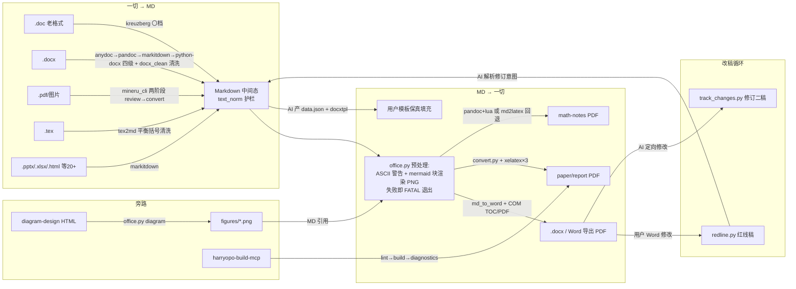

# Repo Wiki — d:\ai\latex 办公文档 AI 生产力平台

> 生成方式：AI 全仓遍历（679 个入库文件，核心为 19 个 Python 脚本 ~7900 行 + LaTeX 模板体系 + 68 篇文档）
> 最后验证：2026-09-18 | 基线 commit：33b4068
> 本文件是 AI 协作知识库：新需求开发前先检索第 4/9/10 章，优先复用，防止重复造轮子。

## 1. 项目概述

**定位**：办公文档 AI 生产力平台（以 `harryopo-office` skill 为载体）。生成标准美观的 **Word / LaTeX / PDF** 三格式并互转，内置编辑级图表能力与修订审阅闭环。

**核心范式（平台铁律）**：AI 只产出结构化数据（Markdown 中间态 / JSON）→ 模板引擎保真渲染 → 输出文档。**绝不让 AI 直接生成 OOXML/PDF 二进制或排版代码**；Office COM 自动化只做渲染后操作（TOC 刷新、PDF 导出、红线核对）。

**目标用户与场景**：中文学术/公文写作——论文（单/双栏）、报告、数理笔记、GB/T 9704 公文；任意格式文档互转；AI 辅助改稿留痕。

**技术栈**：
- 排版引擎：XeLaTeX（ctex/xeCJK + 方正字体内嵌 + XITS Math）；python-docx + docxtpl + lxml（Word）；MML2OMML.XSL（公式→OMML）
- 解析路由：kreuzberg（老 .doc）→ anydoc（Rust）→ pandoc → markitdown → python-docx；MinerU 3.4.5（PDF/扫描件版面级）
- 图表：diagram-design（39 类型 HTML/SVG，规范驱动）+ mermaid（mmdc）双引擎；playwright 渲染 PNG
- 修订：python-redlines（内嵌 .NET Docxodus）+ 自研 track_changes（ECMA-376 w:ins/w:del 直构）
- 服务化：harryopo-build-mcp（MCP 2.x stdio）；Word/PPT COM（pywin32，仅 Windows）
- 运行：Windows + Python 3.10+（当前 Anaconda 3.13）+ TinyTeX + pandoc 3.11；无服务端部署形态，纯本地 CLI/skill

**阶段**：开发中（方案书 v3 P0/P1 已收官，P2 待启动）。

## 2. 仓库目录结构

```
d:\ai\latex\
├── README.md / README.en.md        # 中英双语门面 + 效果 gallery（docs/assets 6 类截图）
├── CLAUDE.md                       # AI 协作规则：13 硬规则 + 30 踩坑警示（总 43 条）
├── memory/MEMORY.md                # 项目全史记忆（923 行/36 节，每批次追加，含经验沉淀）
├── .trae/skills/harryopo-office/   # ★ 核心 skill（自包含，可整体拷贝分发）
│   ├── SKILL.md                    #   流程定义：8 步主流程 + 8 硬约束 + 11 触发词路由
│   ├── scripts/                    #   全部功能脚本（见 §3/§4）
│   │   ├── office.py               #     ★ 统一主入口（6 子命令总编排）
│   │   ├── convert.py md2latex.py tex2md.py docx_clean.py mineru_cli.py
│   │   │   html_table_to_latex.py text_norm.py                    # 转换/清洗引擎
│   │   ├── redline.py gb9704_check.py                              # 修订/公文
│   │   ├── build_mcp.py latex_diagnostics.py                       # MCP 编译诊断
│   │   ├── diagram_render.py diagram_design_render.py mermaid_render.py  # 图表
│   │   ├── pandoc/                 #     mathnotes-template.latex + mathnotes-table.lua
│   │   ├── word/                   #     md_to_word.py / word_template_engine.py /
│   │   │                             track_changes.py / configs/×2 / template/ 五件套
│   │   └── word/template/          #     docxtpl 子 skill + 模板注册表
│   ├── skills/diagram-design/      #   内嵌图表规范（117+ HTML 示例、53 references、self_check）
│   └── templates/                  #   skill 自带 LaTeX 模板副本（编译以项目根为准，见 §9）
├── templates/                      # 项目根 LaTeX 模板体系（编译单一事实来源）
│   ├── cls/                        #   base.sty v4.2 / paper.cls v4.0(含 gov) / report.cls / flushend.sty
│   ├── fonts/                      #   19 文件：方正 FZ*JW×6 + XITS + texgyreheros 等
│   ├── paper/ report/              #   编译工作目录（office.py/build_mcp 拷入 *-e2e.tex）
│   ├── math-notes/                 #   独立体系（mathnotes.cls v1.0，不加载 base.sty）
│   ├── registry/                   #   模板注册表 manifest.json（4 内置模板 + schemas）
│   ├── previews/                   #   agent-architecture.md（skill 内另有 5 示例+CSS）
│   └── build.ps1                   #   编译脚本 v4.2（环境自检+TEXINPUTS+xelatex×3）
├── docs/plans/ (10) research/ (14) # 方案书 v1→v3 演进 + 全部调研报告
├── shared/diagram_geometry.py      # 图表几何质量校验共享库（边穿节点/重叠/端口扇出）
├── skills/harryopo-tikz-diagram/   # TikZ 图 skill（4 模板：流程/分层架构/组织树/时序）
├── scripts/yaml2ir.py              # flowchart-generator YAML → fireworks IR 转换器
├── output/examples/                # 6 官方示例（md/docx/tex/pdf 全格式，入库展示）
├── 蒸馏区/ test-e2e*/ 测试区/ 参考资料/ 简历/  opensource-reference/ .learnings/
│                                   # 外围：风格蒸馏子项目 / 测试快照 / 参考 / 隐私(gitignore) /
│                                   # 开源克隆(gitignore) / 学习日志
└── .gitignore                      # 关键：output/* 白名单 examples；*-e2e.* 排除；简历排除
```

## 3. 模块架构与调用关系

### 3.1 模块清单

| 层 | 模块 | 职责 |
|----|------|------|
| 入口编排 | `office.py` | 7 子命令：render（word/paper/notes/slides 四链路）/ template / diagram / redline / revise / govcheck / info；路径常量单一事实来源（CLS_DIR/FONTS_DIR/PAPER_DIR/NOTES_DIR/SLIDES_DIR）；ASCII 护栏；环境探测（tex/pandoc 补 PATH） |
| 解析层 | `mineru_cli.py` `docx_clean.py` `html_table_to_latex.py` + kreuzberg/anydoc/pandoc/markitdown | 任意格式 → MD 中间态 |
| 引擎层 | `convert.py`(MD→tex) `md2latex.py`(笔记) `word/md_to_word.py`+`word_template_engine.py`(MD→docx) `tex2md.py`(tex→MD) | 双向转换与渲染 |
| 护栏层 | `text_norm.py` | CJK 标点全角化 + 中西空格清理（双引擎入口统一接入） |
| 图表层 | `diagram_render.py`(MD 块自动) `mermaid_render.py`(mmdc) `diagram_design_render.py`(HTML→PNG) + shared/diagram_geometry.py | 双引擎出图 |
| 修订层 | `redline.py`(用户改动留痕) `word/track_changes.py`(AI 改动留痕) | 改稿双向闭环 |
| 公文层 | `gb9704_check.py` + paper.cls `gov` 选项 | 国标生成 + 合规 lint |
| 模板层 | `word/template/` 五件套 | docxtpl 填充 + 注册表元数据 |
| 服务层 | `build_mcp.py` + `latex_diagnostics.py` | MCP 编译诊断闭环 |

### 3.2 数据流（MD 中间态为唯一枢纽）



## 4. 已实现能力清单【核心：防重复造轮子】

### 4.1 文档生成/转换（14 项）
| 能力 | 入口 | 适用 |
|------|------|------|
| MD→Word（方正/开源字体、自动目录、OMML、三线表、图注表注、列表嵌套、摘要关键词、参考文献悬挂缩进） | `office.py render x.md -f word [--pdf] [-c opensource]` | 公文/学术 docx |
| MD→LaTeX paper（单/双栏、dark 主题、nomath、gov 公文） | `render -f paper [--type paper/report] [--twocolumn] [--gov]` | 论文/报告 PDF |
| MD→数理笔记 PDF | `render -f notes`（pandoc 主引擎，缺则纯 Python 回退） | 笔记/讲义 |
| DOCX/PDF/图片/PPTX 等 25+ 格式→MD | `render 任意文件`（自动路由五级） | 转换入口 |
| LaTeX→Word/PDF 反向 | `render x.tex`（tex2md） | 反向链路 |
| .doc 97-2003 老格式 | 自动（kreuzberg 〇档 + 域代码清洗） | 盲区补齐 |
| MinerU 两阶段人工闸门 | `mineru_cli.py x --stage review/convert` | 扫描件确认解析 |
| HTML 合并单元格表→LaTeX | `replace_html_tables_in_markdown`（colspan/rowspan→multicolumn/multirow；>20 行 longtable） | 复杂表 |
| docxtpl 模板填充（extract schema→data.json→render，图片/循环/条件/合并） | `docx_template.py extract/validate/render` | 用户模板 100% 保真 |
| 模板注册表（入库/发现/schema/manifest 严格校验/builtin 保护） | `office.py template add/list/search/describe/schema/remove/update-usage` | 模板中央元数据 |
| CJK 文本规范化 | 双引擎自动接入（`normalize_markdown`） | 标点/空格治理 |
| 图描述 MD 环节 | SKILL.md 主流程第⑤步（流程约束，非代码） | 画图前设计确认 |
| GB/T 9704 合规检查（docx/tex/cls 三模） | `office.py govcheck 文件 [--json]` | 公文验收门 |
| **公文生成双格式** | `office.py render x.md --format word --gov`（Word 侧 gov.json 配置驱动，govcheck 8/8 闭环）/ `--format paper --gov`（cls gov 选项） | 党政机关公文（2026-09-18 Word 侧补齐） |
| LaTeX 编译诊断闭环 | MCP 三工具 / `latex_diagnostics` 库直调 | 编译排错 |
| **演示文稿 PDF（beamer 三主题）** | `office.py render x.md --format slides [--theme blue/dark/plain]` | 答辩/路演/汇报（2026-09-18 新增） |

### 4.2 修订审阅（改稿双向留痕）
- **redline**：`office.py redline 初稿.docx 修改稿.docx -o 红线稿.docx [--engine wmlcomparer|docxdiff]`——原生 w:ins/w:del，免装 Word
- **track_changes / revise**：`office.py revise 初稿.docx 二稿.docx --rev '[{"op":"replace","find":"A","replace":"B"}]'`——AI 修改留痕（replace/delete 用 find/replace 键，insert_after 用 anchor/text 键）；亦可裸调 word/track_changes.py

### 4.3 图表（双引擎）
- diagram-design 39 类型：AI 按规范手写 HTML/SVG → `office.py diagram x.html -o x.png --svg --check`（playwright 截图 + self_check 无障碍契约）
- mermaid：MD 内嵌 ` ```mermaid ` 块，`office.py render` 自动渲染替换（缓存去重）
- 质量校验共享库：`shared/diagram_geometry.py`（重叠/穿边/越界/文字溢出/引用完整性）
- 拦截护栏：ASCII 字符画 [WARN]；super-diagram 块 [FATAL]（引擎已移除，引导改 diagram-design）
- TikZ：`skills/harryopo-tikz-diagram/` 4 套模板（独立 skill）

### 4.4 基础设施（复用点）
`office.py` 可 import：`run()`(subprocess utf-8 封装)、`_ensure_tex_on_path()`/`_ensure_pandoc_on_path()`(PATH 探测)、`collect_output()`(锁文件改名容错)、`ensure_placeholder_figures()`(缺图自动占位)、路径常量。委托模式：子命令 subprocess 透传，零重复实现。

## 5. 核心 API & 公共函数文档

| 函数/接口 | 作用 | 入参 | 返回 | 注意事项 |
|-----------|------|------|------|----------|
| `build_document(md_text,config_path,output_path,update_toc,base_dir,export_pdf)` | MD→docx 全流程 | base_dir=MD 所在目录 | 输出路径 | 未闭合 `$$` 抛 ValueError；相对图片路径按 base_dir 解析 |
| `WordTemplateEngine.add_title/abstract/toc/heading1..4/body/list_item/annotation/caption/picture/table/references/equation/figure_placeholder` | 元素级渲染 API | 各异（见源码 docstring） | None | add_equation 收 OMML lxml 元素；add_table 标题/注在表**下方** |
| `latex_to_omml(latex)` | LaTeX→OMML（标准链路） | 字符串 | lxml oMath 或 None | 依赖 latex2mathml + Office MML2OMML.XSL；None 时调用方走轻量解析器兜底 |
| `convert_md_to_tex(md,doc_type,...,gov)` | MD→tex | — | tex 路径 | gov 全链已通（DOCX 旁路 2026-09-18 修复）；report 不接 gov |
| `tex_to_md(tex_path)` | tex→MD | — | MD 文本 | 列表降为无序；表格黑体不转 ** |
| `clean_pandoc_md(text, tables)` | pandoc MD 清洗 | tables 来自 extract_docx_tables | 清洗文本 | 反转义仅 `[]<>"*`；`_ \# & % $ {}` 保持转义 |
| `extract_docx_tables(path)` | python-docx 提表 | — | list 三维 | 缺库抛 ImportError（调用方须硬失败）；.doc 非 zip 会 ValueError |
| `strip_kreuzberg_fieldcodes(text)` | 老 .doc 域代码清除 | — | 文本 | TOC/HYPERLINK/PAGEREF 整行删 |
| `normalize_markdown(md)` | CJK 标点/空格护栏 | 全 MD | 新 MD | 自动保护围栏/公式/URL/行内代码；已接双引擎 |
| `make_redline(orig,mod,out,author,engine)` | 红线稿 | 两 docx | out 路径 | 同路径输入 return 1；清华镜像无 python-redlines |
| `apply_revisions(docx,out,revisions,author)` | 修订应用 | `[{op,find,replace,anchor}]` | `{applied,skipped,out}` | **find 必须单 run 内**；不含表格/页眉 |
| `parse_log(log_text)` / `lint_tex_file(path)` | 编译日志诊断 / L01-L07 静态预检 | — | dict `{success,pages,errors,warnings,overfull}` / `{problem_count,problems}` | 纯函数无 MCP 依赖，可独立复用 |
| `check_docx(path)` / `check_tex(path)` | 公文合规 | — | `{item,actual,pass,basis}` 列表 | tex 模式自动下沉 cls 的 gov 分支取真值 |
| `extract_and_render(md,fig_dir)` / `replace_in_md(text,repl)` | MD 图表块→PNG | — | dict / 新 MD | 任一失败保留代码块（由 office.py 计数 FATAL） |
| `render(html,png,scale,svg_only)` | diagram-design→PNG | — | bool | self_check.py 缺失时**放行**（勿依赖） |
| `harryopo_build/diagnostics/lint` (MCP) | 编译/诊断/预检 | tex 路径 | JSON | 仅 .tex；编译必在 templates 子目录（自动处理） |
| `register_template(docx,name,category,tags,...)` 等 CLI | 注册表操作 | — | manifest 更新 | 未知字段拒绝加载；id 唯一 |

## 6. 配置项 & 环境变量

**配置文件**：
- `word/configs/fangzheng.json` / `opensource.json`：结构同构（fonts 8 键 title/h1-h4/body/annotation/english + colors 4 + page A4 边距 2.54/3.17cm + styles 6 字号）。差异仅 fonts：方正 `_GBK` 商用需授权 vs Windows 系统字体免授权。`-c opensource` 切换
- `templates/registry/manifest.json`：16 字段白名单，枚举 format(docx/latex/markdown/html)/source(builtin/user)/engine
- `.gitignore`：output/* 白名单 examples；`*-e2e.*` 编译副产物排除

**环境变量**：
| 变量 | 用途 | 默认 |
|------|------|------|
| `MML2OMML_XSL` | OMML 转换 XSL 路径 | Office16/15 安装路径探测 |
| `SUPER_DIAGRAM_SCRIPT` | 【已废弃】引擎 9/02 移除 | — |
| `PUPPETEER_EXECUTABLE_PATH` | mermaid 渲染浏览器 | 未设则探测 Windows Edge/Chrome |
| `DIAGRAM_SHARED_DIR` | 几何校验库目录（super-diagram 遗留） | 项目根 shared/ 自动向上探测 |
| `MINERU_MODEL_SOURCE` | MinerU 模型源 | modelscope（首跑自动下载） |
| `TEXINPUTS` | LaTeX 搜索路径 | office.py 注入 `{CLS}//;{FONTS}//;` |
| `PLAYWRIGHT_DOWNLOAD_HOST` | chromium 镜像 | npmmirror（安装时） |

## 7. 依赖库与官方资料要点

| 依赖 | 版本 | 与本项目强相关的要点 |
|------|------|---------------------|
| python-redlines | 0.3.0 | MIT；内嵌 .NET Docxodus 预编译 wheel（Win/mac/Linux 免装 Word）；两比对引擎 wmlcomparer(默认)/docxdiff(结构感知)；PyPI 官方源才有，清华镜像缺包 |
| markitdown | ≥0.1.7 | 微软官方；0.1.7 修复 omml 公式/SVG/LaTeX 宏模板 bug（旧版公式转丢） |
| MinerU | 3.4.5 | 3.x 无稳定内部 pipeline API（PipelineAnalyze 已删，改流式）；官方 CLI 是"本地 mineru-api + HTTP"架构，首次模型下载时健康检查必超时；稳定做法＝直调 `mineru.cli.common.do_parse(backend='pipeline')`；DOCX office 后端不需模型 |
| kreuzberg | 4.10+ | MIT，Rust 核 35MB wheel 免模型；唯一稳定覆盖 .doc/.xls/.ppt 老二进制；输出残留域代码需清洗 |
| docxtpl | 0.20 | Jinja2 语法嵌 .docx；0.20 移除 get_defined_variables（schema_extractor 已适配）；占位符必须连续同 run；图片相对路径以 cwd 为基准 |
| latex2mathml + MML2OMML.XSL | — | LaTeX→MathML→OMML 业界主流链路（tex2word 同款）；XSLT 根元素可能就是 m:oMath 需双分支处理 |
| pywin32 (Word COM) | — | `SaveAs2 FileFormat=12` 保 OMML；`ExportAsFixedFormat ExportFormat=17, OptimizeFor=0, CreateBookmarks=1`；TOC 域 fldChar begin/separate/end 三段式 |
| playwright | — | chromium 经 npmmirror 镜像安装；仅截 SVG 用 getBoundingClientRect+clip |
| mcp (Python SDK) | 2.1+ | **FastMCP 已改名 `mcp.server.mcpserver.MCPServer`**（1.x 的 fastmcp 路径失效） |
| python-docx | 1.2+ | 表格/节属性直读；lxml 属性 `xml:space` 必须写完整命名空间 |
| pandoc | 3.11 | lua filter AST 级表格处理（cell_to_latex 保数学）；`markdown-smart` 后缀语法控制弯引号 |
| XeLaTeX/TinyTeX | TL2026 | 字体 `Path=../fonts/` 相对**编译 cwd**（编译目录铁律根因）；tlmgr 清华镜像可能 404 HTML 污染装包（flushend 实例）；`\node[below=..of]` 需 positioning 库 |
| ECMA-376 (OOXML) | 公开标准 | w:ins/w:del 修订标记结构——自研 track_changes 依据，无需 Node 生态 |

## 8. 技术债务、限制、TODO

**已知缺陷**（2026-09-18 清理批次后）：
1. ✅ **已修** `convert_docx_to_tex` gov 参数链断裂 → DOCX→TeX `--gov` 现正常工作（签名补 gov + CLI 透传，E2E 出 gov PDF）
2. ✅ **已修** `track_changes.py` 已注册为 `office.py revise` 子命令（与 redline 对称的改稿留痕入口）
3. ⬜ 未处理 `mermaid_render.py` 与 `diagram_render.py` 存在近乎双生的 `find_blocks/code_hash/extract_and_render` 重复实现（低优先级）
4. ✅ **已修** `verify_redline` comments 死字段已删；`gb9704_check` docstring `[--gov]` 虚宣传已改（实为从 documentclass 自动检测）
5. ⬜ 未处理 `mermaid_render._ensure_puppeteer_path` 仅 Windows 硬编码，非 Win 失效；`fmt` 参数未参与 mmdc 命令行
6. ✅ **部分修** `diagram_render` 未使用 import（json/os/subprocess/tempfile）已删；self_check 缺失放行是设计保留
7. ⬜ 未处理 `seed_builtins.py` 内置模板源路径硬编码 `d:\ai\latex\...`（跨机失效）
8. ⬜ 未处理 CLAUDE.md 记"18 个内嵌字体"，实测 19 个（文档小偏差）

**限制（设计性）**：track_changes 单 run 匹配（跨 run 不支持）；docx_clean 反转义白名单外保持；registry latex schema 为 M2 占位（`tex-placeholder-v1`）；schema 类型推断全 string；marker/docling 网络阻塞判 Hold（HF Xet 存储墙）；Word 链路依赖本机 MS Office（Windows-only），LaTeX/PDF 链路跨平台；方正字体商用授权。

**TODO 清单（方案书 v3 §6 未动项）**：✅ P2 演示文稿链路已完成（2026-09-18 定调 beamer/PDF 路线，harryopo-slides 三主题 + MD 自动链路，不做可编辑 .pptx）；✅ 公文 Word 模板国标化已完成（2026-09-18 `--format word --gov` + govcheck 8/8 闭环）；⬜ 剩余 P2——word-mcp-live 适配器、Citra 证据回溯、模板注册表 v2（样式保真校验）、IDE 配置分发；⬜ P3 — Typst 通道、模板市场/多人协作、pdfcpu 后处理、HermesOffice 往返对标。代码内 TODO：【信息缺失——脚本注释无显式 TODO 标记，以上以方案书为准】

## 9. 复用开发指引

**开发新需求前必答三问**：① §4 能力清单是否已有？② §5 API 表能否直接调用？③ 能否通过 SKILL.md 流程组合现有能力解决？

**直接复用，禁止重写**：
- 路径/环境：一律 `from office import CLS_DIR, FONTS_DIR, run, _ensure_tex_on_path`（build_mcp 是范例——office.py 为单一事实来源）；字体/cls 有项目根与 skill 内嵌两份副本，**永远锚项目根**（`_find_project_root` 跳 `.trae` 的写法照抄）
- 文本清洗：MD 规范化先想 `text_norm`；LaTeX 特殊字符/URL 处理遵循"公式保护→URL 保护→转义→语法转换→恢复"顺序铁律（convert.py:parse_inline 为参考实现）
- 表格：HTML 表→`html_table_to_latex`；pandoc 表→`docx_clean.extract_docx_tables`；合并单元格→tabular 固定列宽（multirow 与 tabularx 冲突）
- Word 元素：只走 `WordTemplateEngine.add_*`，不手拼 OOXML（修订标记例外——track_changes 是合法直构点，扩展时遵循 deepcopy rPr 保格式模式）
- 新子命令：仿 `cmd_redline/cmd_govcheck` 的"库函数 + main() argparse + office.py subprocess 透传(REMAINDER)"三段式
- 编译类新功能：复用 `build_mcp._compile` 逻辑（xelatex×3、nonstopmode、'Output written' 判据、>5000 字节门槛）
- 图表新需求：先查 diagram-design 39 类型是否覆盖（assets 有示例 HTML 可抄结构）；**不要再引入 super-diagram**（9/02 已决策收敛双引擎）

**需新增开发时保持风格**：中文注释/docstring 说明"为什么"；失败显式 `[WARN]/[FATAL]` + exit 1（禁止静默降级，本项目最高频教训）；subprocess 必带 `encoding='utf-8', errors='replace'`；异常分支禁止破坏性操作（taskkill 教训）；正则里 `\h` 等非法转义在 Python 3.13 直接抛错；新能力同步 SKILL.md 触发词表 + memory/MEMORY.md + CLAUDE.md 踩坑编号。

**修 bug 优先项**：§8-1/2/4/6 已于 2026-09-18 清理批次修复；剩余 §8-3（mermaid/diagram 双生重复）、§8-5（puppeteer 仅 Windows + fmt 未生效）、§8-7（seed_builtins 硬编码路径）、§8-8（CLAUDE.md 字体数偏差）为低风险小切口，可择机处理。

## 10. Wiki 检索索引

| 关键词 | 章节 | 关键文件 |
|--------|------|---------|
| 生成 Word / docx / 方正字体 / OMML 公式 / 三线表 / 目录 / 悬挂缩进 | §4.1,§5 | word/md_to_word.py, word/word_template_engine.py |
| 论文 / 报告 / PDF / 双栏 / 主题 / 笔记 | §4.1 | convert.py, templates/cls/, md2latex.py |
| 公文 / GB-T 9704 / gov / 仿宋三号 / 页边距 | §4.1 | gb9704_check.py, paper.cls(gov 分支) |
| 转换 / 解析 / docx pdf 图片 pptx / 老 .doc / 扫描件 / 域代码 | §3.2 | office.py 解析路由, mineru_cli.py, docx_clean.py, kreuzberg |
| LaTeX 转 Word / 反向 | §4.1 | tex2md.py |
| 模板 / docxtpl / schema / 注册表 / 保真填充 | §4.1 | word/template/ 五件套, templates/registry/ |
| 图表 / 架构图 / 流程图 / mermaid / diagram-design / HTML 转 PNG / 字符画拦截 / 质量校验 | §4.3 | diagram_*.py, skills/diagram-design/, shared/diagram_geometry.py |
| 修订 / 红线稿 / 改稿 / track_changes / w:ins / 留痕 | §4.2 | redline.py, word/track_changes.py |
| 编译报错 / 诊断 / lint / Overfull / MCP | §4.1,§5 | build_mcp.py, latex_diagnostics.py |
| 标点 / 全角 / 空格规范化 | §5 | text_norm.py |
| 字体清单 / 环境变量 / 配置 | §6 | configs/*.json |
| 依赖版本坑（markitdown/MinerU/MCP/docxtpl） | §7 | memory/MEMORY.md 对应日期节 |
| 已知 bug / 技术债 / 下一步做什么 | §8 | docs/plans/2026-08-30-...v3.md §6 |
| 开发规范 / 历史决策 / 踩坑 43+ 条 | §9 | CLAUDE.md, memory/MEMORY.md, .learnings/ |
| 示例 / 效果展示 | §2 | output/examples/, docs/assets/ |
