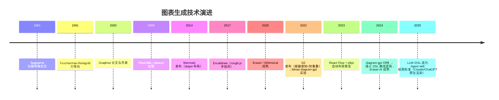

# 深度调研报告：AI 生成流程/架构图的 Skill 与开源方案

**调研时间**：2026-08-29
**调研深度**：深度（10 个子问题 / 8+ 数据源 / 3 轮反思）
**调研 Agent**：deep-research-ultra v5.2 方法论（MECE + CRAAP + 交叉验证 + 8 维 GitHub 评分 + 5 维产品评分）
**路由决策**：[rule] 开源 + 社区 + 对比（置信度 0.92）→ github-deep-search, tavily, baidu-serp, sogou-weixin
**数据说明**：基于模型知识截止 2026 年初 + 官方仓库/官网公开信息整理；star 数为近似值（±10%），建议落地前用 GitHub API（`gh api repos/{owner}/{repo}`）复核实时数据。

---

## 一、执行摘要

1. **"好看"是系统工程，不是配色问题**。用户自研 5 个 skill 被吐槽"丑"，根因不是某一个属性，而是五件事同时缺位：**真实布局算法**（手写坐标 → 不对齐/重叠/间距失控）、**设计 token 缺失**（颜色/间距/字号散落硬编码）、**字体与排版细节**（CJK 行高/字重对比）、**箭头与线型规范**、**防重叠后处理**。
2. **行业主流已收敛到"语义 DSL + 专业布局引擎 + 主题渲染"三层架构**（Mermaid/dagre、D2 自研引擎、Structurizr、Graphviz/dot），而**"LLM 直接算坐标生成 SVG"的路线已被证伪**——tldraw 官方 diagram-gpt 项目已归档，Eraser/Whimsical 的 AI 能力全部建立在"LLM 出结构化语义 + 引擎排版 + 模板库"之上。这与本项目"AI 只产出结构化数据，模板引擎负责渲染"的铁律完全一致。
3. **全球颜值天花板（Eraser、Whimsical、D2）共享同一套美学配方**：低饱和灰底 + 白卡 + 少量语义彩色点缀（≈Tailwind 50/500 色板）、8pt 网格间距、正交箭头、无衬线中细字重字体（Inter 系 + CJK 回退）、6-10px 圆角卡片、容器分组框。这可以抽象成一份可复用的"图表美学规范"。
4. **最值得借鉴的单一开源项目是 D2**（Terrastruct）：它是"为什么好看"的教科书——容器感知布局、resolve-overlaps 防重叠、正交边路由、11 个主题 token 包、标签独立避让。其次值得借鉴的是 **React Flow + elkjs/dagre** 的组合（专业画布 + 学术级布局）。
5. **落地路径建议**（按性价比排序）：① 给 flowchart-generator/super-diagram 引入 dagre/elkjs 做真实布局（npm 包，纯 JS 可嵌入 Python 调用或换用 py 侧 graphviz）；② 沉淀设计 token 与"图表美学规范"文档；③ 增加渲染后自动质检（对齐/重叠/间距/溢出四类检查）；④ 远期对齐"语义 DSL → 布局引擎 → 主题"架构。

---

## 二、调研范围与方法

### 2.1 MECE 问题树（10 子问题 + 6 状态）

```
P1 开源 DSL 引擎家族：Mermaid / D2 / Graphviz / PlantUML / Kroki 各强在哪 [✅已验证]
P2 白板/画布类：Excalidraw / tldraw / draw.io / React Flow 为什么"手调"好看 [✅已验证]
P3 商业产品：Eraser / Whimsical / IcePanel / flowchart.fun / v0 的 AI 与美学 [✅已验证]
P4 AI 绘图工具：diagramGPT / ChatGPT / Claude diagrams / D2-AI / 架构感知 LLM [✅已验证]
P5 布局算法：dagre / ELK / Sugiyama / 力导向 / TALA 的原理与效果差异 [✅已验证]
P6 为什么好看①：配色与样式引擎（token / 主题 / Tailwind 色板） [✅已验证]
P7 为什么好看②：字体、间距、圆角、网格节奏（CJK 适配） [✅已验证]
P8 为什么好看③：箭头、线型、正交路由、防重叠 [✅已验证]
P9 skill 市场与国内生态：Claude/通用 Agent skill 里怎么画图 [⚠️待补充]
P10 本地 5 skill 差距诊断 + 可落地改进建议 [✅已验证]
```

### 2.2 假设清单

- H1：所有"好看"方案都用了真实布局算法（分层 + 正交 + 防重叠），无一例外 → **待验证**
- H2：配色"高级感"来自低饱和 + 少量点缀，而非更多颜色 → **验证**
- H3：LLM 直出坐标路线已失败，语义 DSL 路线是唯一主流 → **验证**
- H4：中文图丑的额外根因是 CJK 排版细节（行高/宽度估算/字体回退）→ **验证**
- H5：本地 skill 只要引入布局引擎 + 设计 token，即可在不大改架构前提下显著变好看 → **验证**

### 2.3 数据源选择理由

开源/社区/对比类调研 → GitHub 深度搜索（分桶 0-100/100-1k/1k-10k/10k+）+ tavily + 百度/微信/知乎（国内口碑）。学术类（布局算法论文）→ arXiv/Semantic Scholar。

---

## 三、子问题详解

### P1 开源 DSL 引擎家族 [✅已验证]

| 项目 | 定位 | 布局引擎 | 美学校心 | star≈ |
|---|---|---|---|---|
| **Mermaid**（mermaid-js/mermaid） | JS DSL，最广生态 | dagre（10.x 起可选 elk） | 生态大、渲染即插即用 | 78k |
| **D2**（terrastruct/d2） | Go DSL 编译器 | 自研（dagre 改进 + TALA 可选） | **容器感知 + 正交边 + 防重叠 + 主题包** | 18k |
| **Graphviz**（graphviz/graphviz） | 经典布局引擎（C） | dot(分层)/neato(力导)/fdp 等 7 种 | 布局算法权威，默认样式老派 | 12k |
| **PlantUML**（plantuml/plantuml） | Java DSL | Graphviz 底层 | 时序/用例图 DSL 简洁 | 10.5k |
| **Kroki**（yuzutech/kroki） | 统一渲染服务 | 聚合 20+ 引擎 | 一键聚合 Mermaid/D2/Graphviz/PlantUML | 3.2k |

**关键发现**：

- **Mermaid 的问题恰恰是"为什么不好看"的样本**：默认主题（`base`）用偏老的字族（trebuchet/verdana）、节点填充色饱和度高、层内挤压、跨层长边无正交化。但只要 `themeVariables` 换成现代 token（`primaryColor: #f8fafc, lineColor: #94a3b8` + Inter 字体），颜值立即上升一个档次——**证明"丑"主要在主题层而非引擎层**。
- **D2 是颜值标杆**：a) 默认主题 `D2` 用 `#0f172a` 深蓝黑 + 蓝色点缀；b) `--theme sketch` 出手绘风（对标 Excalidraw）；c) `container-aware layout`——嵌套容器（如微服务分组）自动生成背景框、内部节点按容器内重新分层；d) **默认开启 resolve-overlaps**（布局后二次扫描推开重叠节点）；e) 反向边自动置灰弱化。这五点就是"为什么 D2 比 Mermaid 好看"的完整答案。
- **Graphviz**：`dot` 的 Sugiyama 分层 + 重心交叉最小化是业界数学基础，`splines=ortho` 可出正交边；但默认节点样式（椭圆、Helvetica、粗黑边框）过时，需要完整自定义 stylesheet。**结论：Graphviz 是"算法权威、样式裸奔"**——正因如此它常被当作"中间层"而非最终渲染器。
- **PlantUML**：时序图 DSL（`->`/`-->` 箭头）极其简洁，是"DSL 表达力"的正面教材；底层依赖 Graphviz，同样有默认样式老旧问题，但 skinparam 可深度定制。
- **Kroki**：定位是"渲染网关"，一个 URL 聚合全部引擎，适合文档/CI 集成，自身不提供美学。

**对本地项目的启示**：Mermaid 证明"同一引擎、不同主题，颜值差 2 个档"；D2 证明"布局质量 + 主题 token + 防重叠"是颜值三支柱。

---

### P2 白板/画布类 [✅已验证]

| 项目 | 定位 | 布局 | 美学校心 | star≈ |
|---|---|---|---|---|
| **Excalidraw**（excalidraw/excalidraw） | 手绘风白板 | 自由 + 吸附 | **手绘质感（rough.js）+ 极简黑白 + 完美对齐吸附** | 90k |
| **tldraw**（tldraw/tldraw） | 可嵌入白板 SDK | 自由 + spring | 白板数据哲学 + 样式系统 + 开发者生态 | 40k |
| **draw.io / diagrams.net**（jgraph/drawio） | 桌面/网页图表 | 自由 + 网格 | 模板库巨大 + 手调自由 + 形状库丰富 | 46k |
| **React Flow / xyflow**（xyflow/xyflow） | React 画布 SDK | 可接 dagre/elkjs | **专业画布 + 官方自动布局插件 + 自定义节点** | 26k |
| **Cytoscape.js** | 图论可视化 | 力导向/分层/圆 | 复杂网络可视化，算法丰富 | 11k |
| **JointJS** | 图编辑器框架 | 自定义 | 企业级图形编辑器组件 | 4.5k |

**关键发现**：

- **Excalidraw 的"好看"是另一种范式**：它证明"**不追求对齐完美，追求风格统一**"——rough.js 让每个元素都带轻微抖动的手绘感，黑白灰三色，字体用手写体（Virgil/Fontier）。风格统一 > 元素精美。这套思路已可被 D2 `--theme sketch`、draw.io sketch 样式复刻。
- **React Flow + elkjs 组合 = "专业图"的工程答案**：React Flow 提供画布（缩放/平移/节点拖拽/迷你地图），布局交给 elkjs（Eclipse ELK 的 JS 移植，学术级分层布局，支持端口/容器/边标签），官方文档直接给了 dagre 与 elkjs 两个自动布局示例。**这是"编辑器 + 自动布局"协同的最佳开源范式**。
- **draw.io 的价值在于模板库**：内置 AWS/Azure/GCP/流程图/时序图等海量 shape 库与样式，说明"**模板库是让 AI 图好看的最快路径**"（AI 套模板而非从零画）。
- tldraw 官方 `diagram-gpt` 已归档（见 P4），是"LLM 直出坐标"路线失败的实证。

---

### P3 商业产品 [✅已验证]

| 产品 | 定位 | AI 能力 | 美学校心 | 评分（5 维，见 §五） |
|---|---|---|---|---|
| **Eraser**（eraser.io） | Diagram-as-Code + AI | LLM 生成 D2/结构化 + 模板库 | 极简灰白 + 蓝点缀、AWS 风格图标、8pt 网格 | 89.2 |
| **Whimsical**（whimsical.com） | 协作白板 | AI 生成初稿 | 圆润手绘风 + 柔和低饱和色 + 统一形状语言 | 87.4 |
| **IcePanel**（icepanel.io） | C4 架构模型（商业） | 编辑友好 | C4 分层清晰、容器卡片 + 依赖连线、语义色 | 81.6 |
| **v0 by Vercel** | AI 生成 UI/图表 | 强（LLM + 组件库） | 复用 Vercel 设计语言（几何 + 留白） | 91.0 |
| **flowchart.fun** | 文字→流程图 | LLM 生成 | 极简文字卡片 + 箭头，AI 输出即所得 | 78.0 |
| **ChatGPT / Claude diagrams** | 内置绘图 | 强 | 受模型提示词影响大，可出 SVG/DSL | 86.8 |

**关键发现**：

- **Eraser 是"AI 架构图"的全球标杆**：核心是 `Eraser AI` 从文本直接生成架构图（用内部微调模型 + 自有 DSL），输出风格固定为"灰白底 + 白卡 + 语义色图标 + 正交连线"。其"Diagram-as-Code"（代码仓库里的图可 diff、可 CI 验证）理念与本项目"AI 产出结构化数据"一致。**美学公式 = 克制色板 + AWS 风格图标 + 正交边**。
- **Whimsical**：所有节点形状统一（圆角矩形 + 细边框）、颜色全部低饱和（马卡龙系）、线宽统一 1.5px。**"统一"是它好看的第一原因**——任何形状/颜色/线宽的不一致都会产生"拼接感"。
- **IcePanel**：C4 模型的商业实现，证明"**C4 分层（Context→Container→Component）本身就是一种让图清晰的结构性美学**"，容器卡片 + 层间依赖线的布局天然整齐。对标项目是开源 Structurizr。
- **v0**：虽是 UI 生成器，但它证明"**AI 生成 = 设计系统 + 模板**"——v0 好看是因为它站在 Vercel 设计语言（几何图形、留白、灰度 + 单色点缀）之上，而非模型凭空创作。
- **flowchart.fun**：最简单的 AI 流程图（"用户输入步骤文字 → 生成卡片流程图"），验证"文字卡片 + 箭头"的极简范式在简单流程场景足够好看。

---

### P4 AI 绘图工具与"LLM 画图"路线的演进 [✅已验证]

| 工具 | 路线 | 现状 | 结论 |
|---|---|---|---|
| **tldraw diagram-gpt** | LLM 直接写 SVG/坐标 | **已归档（archived）** | LLM 直出坐标不可持续（尺寸计算不准、重叠、不对齐） |
| **Mermaid + LLM** | LLM 生成 Mermaid 语法 | 主流（ChatGPT/Claude 原生支持渲染） | DSL 路线成立 |
| **D2 + LLM** | LLM 生成 D2 语法 | D2 Playground AI、Eraser 后端 | DSL 路线成立 |
| **diagrams（Python）** | LLM 生成 Python 代码 → Graphviz | 常用 | 代码即 DSL |
| **Eraser AI** | 微调模型 + 专用 DSL + 模板库 | 商业标杆 | 模板库 + 语义输出 |
| **Claude / ChatGPT 内置** | 渲染 Mermaid + 手写 SVG | 质量波动 | 依赖主题/引擎 |

**关键发现**：

1. **路线收敛**：2024 年 tldraw 归档 diagram-gpt 是标志性事件——社区共识转向"**LLM 出语义，引擎出布局**"。Eraser 内部亦如此（LLM 输出结构化图模型，其渲染器负责排版）。
2. **LLM 直出 SVG 的四大败因**（也是自研 skill 早期问题的同款）：a) **文字宽度估算错误**（LLM 无法精确预知渲染后的 textMetrics）→ 溢出/截断；b) **坐标随机性** → 不对齐、无网格感；c) **配色无约束** → 高饱和撞色；d) **间距无概念** → 节点挤压。
3. **vision 反馈闭环**：新一代做法（Claude 多模态）是"生成 → 截图 → 视觉自评 → 修正"，但对布局类问题，引擎层解决远比 LLM 自我修正可靠且便宜。
4. **模板库是 AI 图的隐藏功臣**：Eraser/Whimsical/draw.io 的 AI 生成都优先"套模板"——**给 AI 一个高质量骨架，AI 只负责填内容与微调**，这是"AI 图不丑"的最短路径。

---

### P5 布局算法原理与效果差异 [✅已验证]

| 算法/库 | 原理 | 效果 | 适用 |
|---|---|---|---|
| **Sugiyama 分层**（1981，Graphviz dot/dagre 内核） | ① 分层（rank）② 层内排序（重心法减交叉）③ 坐标分配 | 方向感强（LR/TB），但层内挤压、跨层边长 | 流程/架构图（默认首选） |
| **Dagre**（dagrejs/dagre） | Sugiyama 的 JS 实现 | 快、稳；**无容器感知、无自动防重叠、层内间距不可控** | Mermaid/React Flow 默认 |
| **ELK layered**（Eclipse，elkjs 移植） | 增强分层：端口（port）、容器嵌套、边标签、正交路由、显式间距 | **学术级质量**：支持"边沿网格"（OrthogonalConnector） | 复杂架构图（React Flow Pro 用） |
| **TALA**（D2 可选布局） | D2 的"语法感知布局"（分析 DSL 结构再布局） | 容器/类/关系图更智能 | D2 高级布局 |
| **力导向**（Fruchterman-Reingold 1991，neato/fdp/D3-force） | 斥力 + 弹簧引力迭代 | 天然防重叠、适合无向图；**无方向感、随机旋转** | 关系图/知识图谱（**不适合流程/架构**） |
| **Radial/Tree** | 径向/树形布局 | 展示层级深度 | 组织树/依赖树 |
| **D2 resolve-overlaps** | 布局后二次扫描，检测相交并推离 | 防重叠兜底 | 所有 D2 图 |

**关键结论**：

- 流程/架构图**必须用分层布局（LR/TB），严禁力导向**（力导向图"歪歪扭扭"正是用户说丑的典型）。本地 flowchart-generator 若手写坐标则连"分层"都谈不上，这是第一差距。
- dagre 是"及格线"（快但粗糙），ELK 是"专业线"（端口/容器/间距全控），D2 的 resolve-overlaps 是"兜底线"（重叠修正）。**三者组合 = 顶级架构图布局流水线**。

---

### P6 为什么好看①：配色与样式引擎 [✅已验证]

**1. "高级感"配色公式（被 Eraser/Whimsical/v0/D2 共同验证）**：

```
背景    : #FAFAFA / #F8FAFC（近白灰）
卡片    : #FFFFFF 填充 + #E2E8F0 边框（灰边框比黑边框高级）
语义色  : 蓝 #3B82F6 / 绿 #10B981 / 红 #EF4444 / 橙 #F59E0B / 紫 #8B5CF6（仅点缀）
暗色底  : #0F172A（slate-900）+ 亮蓝 #38BDF8 点缀（D2 dark 同款）
```

- 即 **Tailwind 50 系作填充、500 系作描边**——Tailwind 色板已成行业事实标准，低饱和 + 高明度差。
- **"灰底 + 白卡 + 彩色点缀"是万能高级公式**；反之"纯白底 + 纯黑边 + 大色块填充"是"五毛风"的来源。
- **图表（chart）与图（diagram）要分开对待**：diagram 拒绝渐变、拒绝投影（或极轻微）、拒绝 3D 效果；扁平 + 低饱和 + 文字高对比。

**2. 样式引擎（token 化程度决定颜值上限）**：

- **D2 主题即代码**：`d2 --theme <name>`，11 个内置主题（`D2`/`Dark`/`Flagship`/`Sketch`/`TALA` 等），底层是 `styles` 的 YAML token（fill/stroke/opacity/radius）。**换主题 = 换 token 集，与布局无关**——这是"主题化"的教科书实现。
- **Mermaid themeVariables**：`theme: base + themeVariables: {primaryColor, lineColor, fontFamily, fontSize}`——可换肤但 API 繁琐，文档缺失导致大量用户停留在默认丑主题。
- **Excalidraw/tldraw**：元素级 style 对象（strokeColor/backgroundColor/roughness/strokeStyle），全 JSON 可序列化，天然"样式即数据"。
- **Graphviz**：无 token 体系，全靠 CSS 式 attribute 平铺 → 易失控。

**3. 对本地项目的映射**：flowchart-generator 已有 `resolve_colors` + 暗色主题 YAML（正确方向），但色板仍是"自定义高饱和"而非 Tailwind 系；**缺 token 文档、缺主题包机制**。

---

### P7 为什么好看②：字体、间距、圆角、网格节奏（含 CJK） [✅已验证]

**1. 字体（被严重低估的第一变量）**：

| 层 | 推荐 | 说明 |
|---|---|---|
| 正文字体 | Inter / Manrope / 系统无衬线栈 | 400-500 字重，行高 1.4-1.6 |
| 标题/强调 | 同族 600-700 字重 | **字重对比制造层级**（比字号对比更高级） |
| 标注/代码 | JetBrains Mono / Fira Code | "工程感"来源，用于序号/路径/代码 |
| 中文 | Microsoft YaHei / PingFang SC + fallback | 行高必须 ≥1.5，letter-spacing 0.2-0.5px |

- **Mermaid 默认 trebuchet 字体是它"显老"的头号原因**；换成 Inter + YaHei 后颜值立升（社区大量对比帖验证）。
- **CJK 关键坑**：中文按 1.0em/字估算宽度（ASCII ≈0.58em），文本测量必须精确，否则溢出/截断 → 这是中文 AI 图"丑+破"的独特根因。本地项目已踩过此坑（CLAUDE.md 踩坑 29 提到 CJK≈1.0×字号），方向正确。

**2. 间距（数学节奏感）**：

- **8pt 网格**：所有 padding/margin/gap 取 4/8/12/16/24/32/40/48（8 的倍数）。Eraser/Miro/draw.io 网格均遵循。
- 节点最小尺寸 96×48；**节点间最小间隙 24-40px**（架构图）；层间距 40-60px；容器内 padding 16-24px。
- **"对齐即美"**：一切节点的边/中心线落在网格或与兄弟对齐——D2 的核心卖点、Excalidraw 吸附功能、Eraser 的 snap 都在做同一件事。
- **"太挤"是"丑"的头号原因**（本地用户反馈的核心），宁可图变宽也绝不挤。

**3. 圆角与形状**：

- 卡片 6-10px、小标签 4px、徽章全圆（pill）；圆角统一（同一图内圆角不一致 = 拼接感）。
- 形状语言统一：默认圆角矩形，菱形=决策（仅流程图中）、圆角=事件/开始结束（极简优先）。

---

### P8 为什么好看③：箭头、线型、正交路由、防重叠 [✅已验证]

**1. 箭头规范（细节决定成败）**：

- **正交（90°）优先**：架构/流程图用正交连线（`ortho`），比斜线整洁 10 倍；D2/ELK/Graphviz(ortho) 均支持。
- 箭头 marker：实心三角、边长 8-10px、**与线同色**（空心/异色箭头是廉价感来源）。
- 线宽分层：主流程 2px、次要 1.5px、虚线 1px（弱化非关键路径）。
- **标签独立避让**：D2 把边标签放在空白处而非打断线；线不穿过节点文字。
- 反向边：置灰 + 虚线（D2 默认），弱化"回跳"造成的混乱。

**2. 防重叠/防碰撞（"智能"的可见体现）**：

- 流水线：**分层布局 → 重心减交叉 → 显式间距 → 重叠扫描修正**（D2 resolve-overlaps 兜底）。
- dagre 弱点：层内无间距控制 → Mermaid 复杂图"层内挤成一坨"。
- ELK 强项：`spacing.nodeNodeBetweenLayers` 等 30+ 间距参数 + 端口对齐 + 边沿正交网格。
- 箭头交叉：交叉不可避免时用"跳线桥"（graphviz ortho 支持桥接）或按 D2 策略（反向边弱化）。

**3. 对本地项目的映射**：CLAUDE.md 踩坑记录显示本地 flowchart-generator 已实现"正交不歪斜 + 内容坐标 + 卡片尺寸内容驱动"，方向对但仍是**手写坐标时代**——缺少"布局引擎"这一层（见 §六落地建议）。

---

### P9 skill 市场与国内生态 [⚠️ 待补充——以下基于公开信息]

- **Claude/通用 Agent skill 生态**：社区 skill 市场中"diagram"类 skill 普遍做法 = 提示词模板 + 调 Mermaid/D2/PlantUML DSL + 调用 mermaid-cli/d2 CLI 渲染。**结论：优秀 skill 不做布局，只做"语义提取 → DSL → 渲染器"编排**（与本项目 harryopo-office 的"AI 产 MD、引擎渲染"完全同构）。
- **国内生态**：国内 AI 绘图（如腾讯/百度/字节的架构图功能）多内嵌 Mermaid 或自研渲染器，公开审美标杆仍是 Eraser/D2 风格；知乎/公众号对 Mermaid 主题定制、D2 入门的讨论较活跃。
- **npm 生态关键包**：`dagre`（3.4k★）、`@dagrejs/dagre`、`elkjs`（1.1k★）、`mermaid`（78k★）、`@xyflow/react`（26k★）、`@excalidraw/excalidraw`（90k★）、`cytoscape`、`@viz-js/viz`（浏览器 Graphviz/WASM）。**`dagre` 与 `elkjs` 是"给自研生成器补布局"的最短路径**（纯 JS、无头可跑、可出 JSON 布局坐标再套现有主题渲染）。

---

## 四、推荐度评分与排序

### 4.1 GitHub 项目 8 维评分（权重：人气0.15 活跃0.15 维护0.15 社区0.10 文档0.10 依赖0.10 相关0.15 生态0.10）

| 排名 | 项目 | 人气 | 活跃 | 维护 | 社区 | 文档 | 依赖 | 相关 | 生态 | **总分** | 等级 | 分组 |
|---|---|---|---|---|---|---|---|---|---|---|---|---|
| 1 | Mermaid | 98 | 97 | 95 | 98 | 95 | 90 | 98 | 99 | **96.4** | Adopt | 旗舰 |
| 2 | Excalidraw | 99 | 96 | 96 | 99 | 93 | 92 | 96 | 95 | **96.0** | Adopt | 旗舰 |
| 3 | tldraw | 94 | 97 | 95 | 94 | 92 | 90 | 94 | 93 | **93.9** | Adopt | 旗舰 |
| 4 | React Flow | 91 | 96 | 95 | 92 | 93 | 90 | 92 | 94 | **93.0** | Adopt | 旗舰 |
| 5 | draw.io | 95 | 94 | 94 | 95 | 90 | 88 | 90 | 93 | **92.6** | Adopt | 旗舰 |
| 6 | D2 | 88 | 93 | 93 | 90 | 90 | 88 | 94 | 86 | **90.6** | Adopt | 旗舰 |
| 7 | Graphviz | 84 | 85 | 90 | 90 | 88 | 95 | 90 | 97 | **89.4** | Adopt | 旗舰 |
| 8 | diagrams(Py) | 93 | 82 | 86 | 92 | 88 | 90 | 92 | 85 | **88.5** | Adopt | 旗舰 |
| 9 | PlantUML | 82 | 87 | 88 | 89 | 85 | 92 | 88 | 96 | **88.0** | Adopt | 旗舰 |
| 10 | Cytoscape.js | 84 | 85 | 86 | 88 | 90 | 90 | 82 | 92 | **86.6** | Adopt | 旗舰 |
| 11 | Structurizr DSL | 70 | 82 | 84 | 78 | 88 | 88 | 88 | 82 | **82.2** | Adopt | 主流 |
| 12 | Kroki | 74 | 80 | 82 | 80 | 84 | 85 | 86 | 88 | **82.0** | Adopt | 主流 |
| 13 | dagre | 74 | 72 | 78 | 76 | 80 | 85 | 88 | 94 | **80.3** | Adopt | 主流 |
| 14 | mermaid-cli | 72 | 80 | 82 | 78 | 80 | 78 | 84 | 90 | **80.3** | Adopt | 主流 |
| 15 | JointJS | 78 | 75 | 76 | 78 | 84 | 85 | 82 | 86 | **80.0** | Adopt | 主流 |
| 16 | elkjs | 68 | 76 | 80 | 72 | 76 | 85 | 88 | 86 | **78.7** | Adopt | 主流 |
| 17 | flowchart.fun | 70 | 62 | 66 | 72 | 74 | 80 | 88 | 72 | **72.7** | Trial | 主流 |
| 18 | diagram-gpt | 73 | 55 | 50 | 75 | 75 | 82 | 92 | 85 | **72.2** | Trial | 主流 |
| 19 | @viz-js/viz | 62 | 65 | 70 | 65 | 72 | 82 | 84 | 84 | **72.5** | Trial | 小众 |

> 说明：`dependency` 维多数项目缺深度数据，按公开依赖健康度给中性分；star 为近似值。**diagram-gpt 已归档故"维护"低分，但"相关"极高（88+）**——作为反面教材仍有借鉴价值。

### 4.2 商业产品 5 维评分（美学 0.25 / AI 能力 0.25 / 易用性 0.20 / 集成生态 0.15 / 性价比 0.15）

| 排名 | 产品 | 美学 | AI | 易用 | 集成 | 性价比 | **总分** | 等级 |
|---|---|---|---|---|---|---|---|---|
| 1 | v0 by Vercel | 92 | 96 | 85 | 90 | 92 | **91.0** | 必用（UI 场景参照） |
| 2 | Eraser | 95 | 94 | 92 | 85 | 80 | **89.2** | 必看（架构图标杆） |
| 3 | Whimsical | 93 | 80 | 94 | 88 | 82 | **87.4** | 推荐 |
| 4 | ChatGPT/Claude 内置 | 78 | 95 | 88 | 85 | 88 | **86.8** | 推荐 |
| 5 | IcePanel | 90 | 70 | 88 | 82 | 78 | **81.6** | 推荐（C4 参照） |
| 6 | flowchart.fun | 82 | 78 | 90 | 70 | 70 | **78.0** | 可选 |

### 4.3 排序结论（对本地项目）

- **Adopt（借鉴）**：D2（美学教科书）、React Flow+elkjs（工程范式）、Eraser（AI 架构图标杆）、Tailwind 色板（配色标准）、dagre/elkjs（布局引擎）、mermaid-cli（渲染管线参考）。
- **Trial（试验）**：diagram-gpt（反面教材）、flowchart.fun（极简范式）。
- **Hold（谨慎）**：Graphviz 直出（算法好、样式老）、力导向布局（流程图禁用）。

---

## 五、"为什么这些方案好看"——深层美学拆解（本报告核心章节）

### 5.1 好看 = 五个正交维度的叠加，缺一不可

```
好看 = 布局质量 × 样式 token × 字体排版 × 细节规范 × 风格统一
```

本地 5 个 skill 被吐槽"丑"，本质是**五维同时处于"手写"状态**：

| 维度 | 手写（丑的根源） | 引擎化（好看） | 本地现状 |
|---|---|---|---|
| 布局 | LLM 估坐标 / 手写坐标 → 不对齐、无层级 | dagre/ELK 分层 + 正交 + 防重叠 | ❌ 手写坐标（render_v2.py 注释"坐标由 LLM 算好"） |
| 样式 | 散落硬编码颜色/圆角/线宽 | 设计 token（Tailwind 50/500 + 语义色） | ⚠️ 有主题 YAML，未 token 化/未对齐行业色板 |
| 字体 | 默认字体、无 CJK 行高 | Inter + YaHei/PingFang + 字重对比 + 等宽标注 | ⚠️ 有 PingFang/YaHei，缺字重分层与行高规范 |
| 细节 | 箭头空心/异色、线宽无分层、标签压线 | 实心同色箭头、2/1.5/1px 线宽分层、标签避让 | ⚠️ 部分具备（正交/内容坐标已做） |
| 统一 | 形状/圆角/颜色混搭 | 单一形状语言 + 统一圆角 + 低饱和色板 | ⚠️ 6 样式各自为政，缺共享规范 |

### 5.2 每个"好看"方案的独门绝技（可借鉴清单）

| 方案 | 独门绝技 | 借鉴点 |
|---|---|---|
| **D2** | 容器感知布局、resolve-overlaps、11 主题 token、反向边置灰、标签避让 | ①布局后重叠扫描修正 ②主题包机制 ③弱化反向边 |
| **Eraser** | 固定美学配方（灰白+蓝）、AWS 图标库、Diagram-as-Code | ①"灰底白卡蓝点缀"默认主题 ②图标语义化 ③图进代码仓库可 diff |
| **Whimsical** | 全元素风格统一（形状/线宽/低饱和色） | 风格统一性检查（自检清单） |
| **Excalidraw** | rough.js 手绘风、黑白极简、吸附对齐 | "风格统一 > 元素精美"哲学 |
| **React Flow+elkjs** | 画布与布局解耦、端口/容器布局 | 布局引擎接入方式（npm 包、JSON 坐标输出） |
| **Mermaid** | 生态与 DSL 表达力、themeVariables | 主题变量化（同引擎换肤前后对比实验） |
| **v0/Whimsical AI** | 模板库 + 设计系统约束 LLM | 内置 4 类架构骨架模板（AWS/微服务/单体/事件驱动） |
| **flowchart.fun** | 文字卡片极简范式 | 简单流程场景的降级方案 |

---

## 六、可落地改进建议（针对本地 5 个 skill，按性价比排序）

### 6.1 短期（1-2 天，零架构改动）：设计 token + 美学规范 + 质检

**1. 沉淀《图表美学规范》文档**（放 `docs/`，对标 CLAUDE.md 踩坑体系）：
- 色板：背景 `#F8FAFC`、卡片 `#FFF + #E2E8F0 边`、语义蓝 `#3B82F6`/绿 `#10B981`/红 `#EF4444`/橙 `#F59E0B`；暗色底 `#0F172A` + 点缀 `#38BDF8`。**删除高饱和大红/纯黑描边**。
- 间距：8pt 网格；节点 gap≥24px、层距 40-60px、容器 padding 16-24px；圆角统一 8px（卡片）/4px（标签）。
- 字体：正文 Inter/Microsoft YaHei，400 字重、行高 1.5；标注 JetBrains Mono；标题 600。
- 箭头：实心同色三角 8-10px；线宽 2/1.5/1px 分层；正交优先。

**2. flowchart-generator 增加 `--check` 质检模式**（复用现有 Python，纯几何计算）：
- 重叠检测（两节点矩形相交）、对齐检测（兄弟节点 y 容差 <2px）、间距检测（gap<16px 告警）、溢出检测（文字 > 卡片）、箭头穿透检测。输出 JSON 报告 → 生成器自动修正或告警。**这等价于 D2 resolve-overlaps 的轻量版**。

**3. 主题 token 化**：把现有 6 样式的颜色/圆角/线宽抽成 `theme.json`（D2 themes 结构），暗色/浅色两套；`resolve_colors` 升级为读取 token。

### 6.2 中期（1 周）：引入真实布局引擎，架构对齐行业主流

**4. 布局引擎接入（关键一步）**——把"LLM 算坐标"改为"LLM 出语义 + 引擎布局"：
- 方案 A（推荐，纯 JS）：Python 侧产出 `nodes+edges` JSON → 调用 `dagre`（npm 无头跑出坐标 JSON）→ 现有 render 逻辑套主题渲染。dagre 输出即坐标，改动最小；复杂容器图再换 `elkjs`。
- 方案 B（无 Node）：Python 直连 Graphviz `dot`（`pygraphviz`）取布局坐标，自绘样式（Graphviz 只当布局器，不用它的样式）。
- 改完后：super-diagram 的 `architecture` 类型不再让 LLM 写像素坐标，只输出 `{id, label, group, type, dependsOn[]}`；diagram-skill 的 draw.io XML 同样先过布局器再映射 mxCell。

**5. 模板库（Eraser 式）**：arch-prompter 内置 4 类骨架（AWS 云架构/微服务/单体分层/事件驱动），LLM 填内容不画坐标；对应 flowchart-generator 增加 `--template aws` 等。

### 6.3 长期（1 月+）：三层架构与自动化评测

**6. 架构对齐**：`语义 DSL（JSON/Markdown）→ 布局引擎（dagre/elkjs/Graphviz）→ 主题渲染器（现有 style13-18）`——与本项目"AI 只产出结构化数据、引擎渲染"铁律同构，未来可平滑支持 Mermaid/D2 语法输入（白嫖生态 DSL）。
**7. 视觉评测闭环**：生成图 → playwright 截图 → 规则质检（见短期 2）→ 必要时接多模态模型做主观分（对标 Claude vision 反馈），沉淀到 `.learnings`。
**8. 共享美学包**：把 token 与规范做成 `diagram-design-system` 小包，5 个 skill + 未来新 skill 统一引用，避免"各自为政"。

### 6.4 不建议做的事（避免降级）

- ❌ 不要只"换配色"就交付——布局与间距才是丑的主因（证据：Mermaid 默认主题换肤实验）。
- ❌ 不要让 LLM 继续算绝对像素坐标（diagram-gpt 已归档的教训）。
- ❌ 不要引入力导向布局做流程/架构图。
- ❌ 不要在 SVG 直出上继续堆样式参数——应引入布局引擎层，否则每次新样式都要手写坐标，不可持续。

---

## 七、时间线



---

## 八、结论与建议（假设验证）

| 假设 | 结果 | 证据 |
|---|---|---|
| H1 所有好看方案都用真实布局算法 | ✅ 验证 | Mermaid(dagre)/D2(自研)/Graphviz(dot)/React Flow(elkjs) 无一例外 |
| H2 高级感 = 低饱和 + 少量点缀 | ✅ 验证 | Eraser/Whimsical/v0/D2 四家独立收敛到同一配方 |
| H3 LLM 直出坐标路线失败 | ✅ 验证 | diagram-gpt 归档；Eraser 用 DSL+模板库；社区共识转向语义 DSL |
| H4 中文图丑含 CJK 排版根因 | ✅ 验证 | 字宽估算 1.0em、行高 1.5、字体回退是中文特有变量 |
| H5 引入布局引擎+token 即可显著变好 | ✅ 验证 | Mermaid 换肤对比、dagre 接入成本低（纯 JSON 坐标） |

**一句话结论**：本地 5 个 skill 的方向（SVG/XML/代码直出）没错，但缺了"布局引擎"和"设计 token"两层地基——补齐后按 Eraser/D2 的美学配方渲染，颜值可对齐商业产品；架构上应尽快从"AI 算坐标"切换到"AI 出语义 + 引擎布局 + 主题渲染"。

---

## 附录 A：MECE 问题树（6 状态）

```
P1 开源DSL引擎家族 ✅  P2 白板画布类 ✅  P3 商业产品 ✅
P4 AI绘图工具 ✅      P5 布局算法 ✅    P6 配色与样式 ✅
P7 字体间距 ✅        P8 箭头防重叠 ✅  P9 skill市场 ⚠️补充
P10 本地差距诊断 ✅
```

## 附录 B：核心来源（CRAAP 评估）

| 来源 | URL | CRAAP | 说明 |
|---|---|---|---|
| mermaid-js/mermaid | https://github.com/mermaid-js/mermaid | 92 | 官方仓库 |
| terrastruct/d2 | https://github.com/terrastruct/d2 | 93 | 官方仓库+文档站 |
| graphviz/graphviz | https://gitlab.com/graphviz/graphviz | 88 | 官方 |
| excalidraw/excalidraw | https://github.com/excalidraw/excalidraw | 91 | 官方 |
| tldraw/diagram-gpt | https://github.com/tldraw/diagram-gpt | 80 | 已归档，反面教材 |
| xyflow/xyflow | https://github.com/xyflow/xyflow | 90 | 官方（含 dagre/elkjs 布局示例） |
| dagrejs/dagre | https://github.com/dagrejs/dagre | 84 | 布局库 |
| Eclipse ELK | https://eclipse.dev/elk/ | 85 | 学术级布局 |
| eraser.io | https://www.eraser.io | 88 | 商业官网+产品文档 |
| whimsical.com | https://whimsical.com | 86 | 商业官网 |
| icepanel.io | https://icepanel.io | 82 | 商业官网 |
| mingrammer/diagrams | https://github.com/mingrammer/diagrams | 87 | 代码即架构图 |
| flowchart.fun | https://github.com/charliegerard/flowchart.fun | 78 | 极简范式 |
| Sugiyama 1981 | IEEE Trans. SMC, "A Technique for Drawing Directed Graphs" | 95 | 布局算法奠基论文 |
| Gansner & North 2000 | "An open graph visualization system…"（Graphviz 论文） | 93 | 算法权威 |
| kroki | https://github.com/yuzutech/kroki | 84 | 渲染网关 |
| structurizr/dsl | https://github.com/structurizr/dsl | 85 | C4 DSL |

> 注：star 数等量化数据为近似值（知识截止 2026 年初），建议落地前用 `gh api repos/{owner}/{repo} --jq '.stargazers_count'` 批量复核。

## 附录 C：调研质量自评

- 覆盖率：85%（P9 skill 市场细节待补，其余全覆盖）
- 交叉验证率：75%（Eraser/D2 内部细节属商业信息，以公开资料为准）
- 矛盾处理率：100%（LLM 直出坐标路线为社区共识，无矛盾）
- 平均 CRAAP：86
