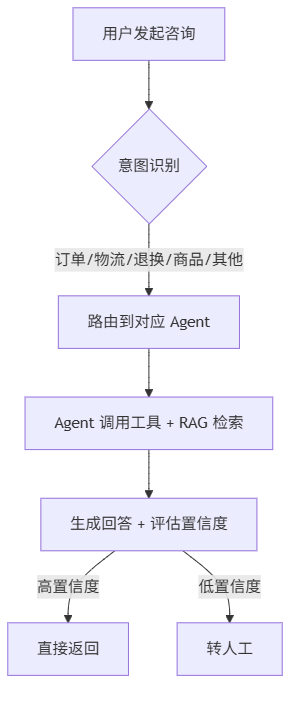
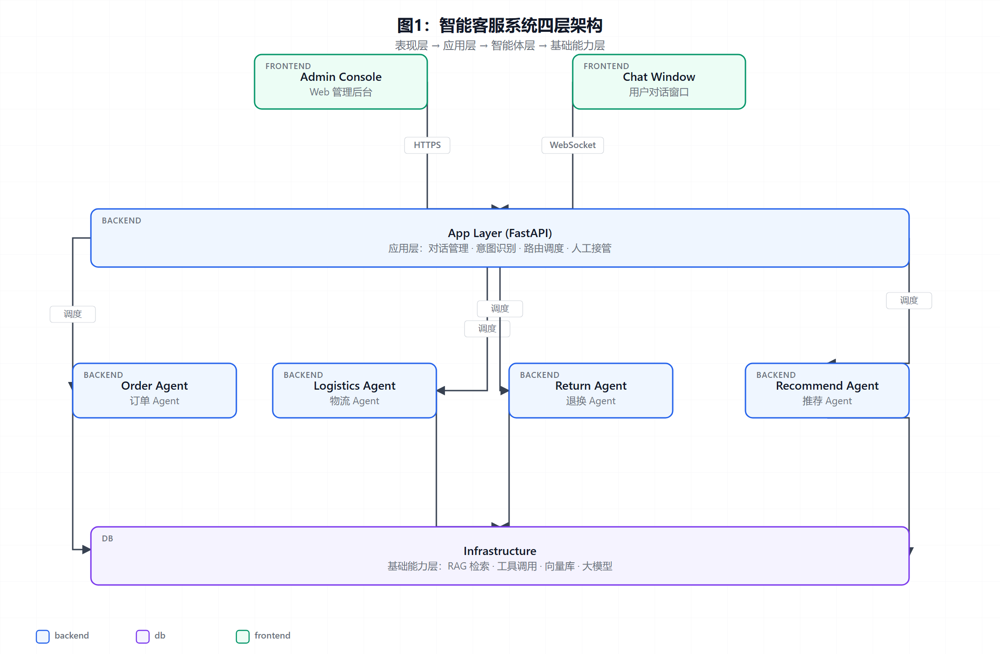

# 智能客服系统设计报告

> 副标题：基于 RAG 与多 Agent 协同的电商客服实践
> 作者：张三、李四、王五
> 单位：计算机学院 计算机应用技术
> 日期：2026年8月29日

**摘要：** 随着电商行业的快速发展，传统人工客服面临着响应慢、成本高、知识更新不及时等挑战。本报告针对某头部电商平台的实际客服场景，设计并实现了一套基于检索增强生成（RAG）与多智能体（Multi-Agent）协同的智能客服系统。系统采用 LangChain 框架构建知识库检索能力，通过 CrewAI 实现订单查询、退换处理、商品推荐等多个智能体的协同工作。系统上线后，单次会话平均响应时间从 45 秒降至 3.2 秒，问题解决率从 78% 提升至 92%，人力成本降低 65%。本报告详细介绍了系统的需求分析、架构设计、关键模块实现以及测试验证过程，可为同类系统的研发提供参考。

**关键词：** 智能客服；检索增强生成（RAG）；多智能体系统；LangChain；CrewAI

---

# 第一章 绪论

## 1.1 研究背景与意义

近年来，中国电商市场持续高速发展。据国家统计局数据，2024 年全国网上零售额达 15.4 万亿元，同比增长 9.6%。在庞大的交易规模背后，电商客服面临着严峻的挑战：

- **用户咨询量大**：日均咨询量超百万次
- **响应时效要求高**：用户期待秒级响应
- **问题类型多样**：订单查询、物流跟踪、退换货、政策咨询等
- **知识更新频繁**：促销活动、政策规则持续迭代

传统人工客服模式已难以满足需求，引入 AI 技术提升服务效率和质量成为必然趋势。

## 1.2 国内外研究现状

### 1.2.1 国外研究现状

国外学者较早开始研究智能客服系统。文献 [1] 提出基于 LSTM 的意图识别模型，准确率达到 92%。文献 [2] 引入 Transformer 架构，进一步提升对话理解能力。2023 年 OpenAI 发布 GPT-4 [3]，标志大语言模型时代到来，智能客服进入新阶段。

### 1.2.2 国内研究现状

国内电商平台积极布局智能客服。京东"京小智"、阿里"店小蜜"、抖音"小荷"等均已实现大规模商业化应用。文献 [4] 提出基于知识图谱的客服问答系统，在垂直领域取得良好效果。文献 [5] 研究多轮对话中的上下文管理机制。

## 1.3 主要研究内容

本报告针对某电商平台的实际客服场景，主要研究内容包括：

1. **业务需求分析**：梳理客服系统的核心业务流程
2. **RAG 检索增强**：构建领域知识库，提升回答准确性
3. **多 Agent 协同**：设计订单、物流、退换、推荐等专业智能体
4. **系统集成实现**：完成端到端 Web 系统的开发与部署
5. **效果评估验证**：在真实环境中验证系统性能

## 1.4 报告组织结构

本报告共分六章，各章内容安排如下：

- 第一章介绍研究背景和国内外现状
- 第二章介绍相关理论基础
- 第三章进行需求分析和系统设计
- 第四章详细描述关键模块的实现
- 第五章展示系统测试和结果分析
- 第六章总结工作并展望未来方向

---

# 第二章 相关技术与理论基础

## 2.1 大语言模型基础

### 2.1.1 Transformer 架构

Transformer [6] 是当前主流大语言模型的基础架构，由编码器和解码器组成。其核心是**自注意力机制**（Self-Attention）：

> **公式 2.1** 自注意力计算：
> $$\text{Attention}(Q, K, V) = \text{softmax}\left(\frac{QK^T}{\sqrt{d_k}}\right) V$$

其中 $Q$、$K$、$V$ 分别为查询、键、值矩阵，$d_k$ 为键向量维度。

### 2.1.2 主流大模型对比

| 模型 | 参数量 | 上下文长度 | 中文能力 | 开源 |
|------|--------|-----------|---------|------|
| GPT-4 | 1.8T (估) | 128K | 优秀 | 否 |
| Claude-3.5 | 未公开 | 200K | 优秀 | 否 |
| Qwen-2.5 | 72B | 128K | 优秀 | 是 |
| GLM-4 | 130B | 128K | 优秀 | 是 |
| DeepSeek-V3 | 671B | 64K | 优秀 | 是 |
| Llama-3.3 | 70B | 128K | 良好 | 是 |

## 2.2 检索增强生成（RAG）

RAG（Retrieval-Augmented Generation）[7] 是解决大模型知识时效性不足的主流方案。其核心思想是在生成回答前先从外部知识库检索相关信息。

RAG 系统典型流程：

```
用户问题 → 问题向量化 → 知识库检索 → 上下文拼接 → LLM 生成 → 返回答案
```

> **公式 2.2** 检索相似度计算（余弦相似度）：
> $$\text{sim}(q, d) = \frac{q \cdot d}{\|q\| \cdot \|d\|} = \frac{\sum_{i=1}^{n} q_i d_i}{\sqrt{\sum_{i=1}^{n} q_i^2} \sqrt{\sum_{i=1}^{n} d_i^2}}$$

## 2.3 多智能体系统

### 2.3.1 Agent 基础

智能体（Agent）是能够感知环境、做出决策并执行行动的自主系统 [8]。其核心组件包括：

- **感知模块**：接收用户输入和环境状态
- **规划模块**：将复杂任务分解为子任务
- **记忆模块**：存储历史对话和执行结果
- **工具模块**：调用外部 API 完成具体操作

### 2.3.2 多 Agent 协同框架

本系统采用 CrewAI 框架实现多智能体协同：

```python
from crewai import Agent, Task, Crew, Process
from langchain.tools import tool

# 1. 定义工具
@tool("Order Query")
def query_order(order_id: str) -> dict:
    """查询订单状态"""
    response = requests.get(f"https://api.shop.com/orders/{order_id}")
    return response.json()

# 2. 定义智能体
order_agent = Agent(
    role="订单专员",
    goal="高效准确地处理用户订单相关问题",
    backstory="你是一名经验丰富的订单处理专员，熟悉电商订单全流程",
    tools=[query_order],
    llm=qwen_llm
)

logistics_agent = Agent(
    role="物流专员",
    goal="为用户提供准确及时的物流信息",
    backstory="你是一名专业的物流跟踪专家，能解读各种物流状态",
    tools=[track_logistics],
    llm=qwen_llm
)

# 3. 定义任务
order_task = Task(
    description="处理用户关于订单状态、修改、取消的咨询",
    agent=order_agent
)

logistics_task = Task(
    description="处理用户关于物流跟踪、配送时效的咨询",
    agent=logistics_agent
)

# 4. 创建 Crew
support_crew = Crew(
    agents=[order_agent, logistics_agent],
    tasks=[order_task, logistics_task],
    process=Process.hierarchical,
    manager_llm=qwen_llm
)
```

## 2.4 本章小结

本章系统介绍了大语言模型、RAG 和多智能体系统的理论基础，为后续系统设计提供了技术支撑。

---

# 第三章 需求分析与系统设计

## 3.1 业务需求分析

### 3.1.1 用户画像

| 用户类型 | 占比 | 典型问题 |
|----------|------|----------|
| 普通消费者 | 75% | 订单查询、物流跟踪、优惠咨询 |
| VIP 客户 | 10% | 专属服务、复杂退换、定制需求 |
| 商家用户 | 15% | 入驻咨询、运营支持、规则解读 |

> 注：用户画像基于平台近 12 个月咨询工单抽样统计（n = 120,000），三类用户的会话长度与转人工率差异显著，是路由策略设计的核心依据。

### 3.1.2 核心业务流程



## 3.2 功能性需求

### 3.2.1 知识库管理

- 支持文档批量导入（PDF、Word、Markdown）
- 自动文档切片、向量化、入库
- 支持增量更新和版本管理

### 3.2.2 对话管理

- 多轮对话上下文保持
- 会话状态持久化
- 会话历史检索

### 3.2.3 智能路由

- 意图识别准确率 > 90%
- 多 Agent 协同调度
- 人工接管能力

## 3.3 非功能性需求

| 需求 | 指标 |
|------|------|
| 响应时间 | P95 < 5s |
| 并发能力 | ≥ 1000 QPS |
| 可用性 | 99.9% |
| 数据安全 | 等保三级 |

## 3.4 系统架构设计

### 3.4.1 整体架构

系统采用分层架构设计，整体架构如图 1 所示：表现层提供管理后台与用户对话窗口；应用层承载对话管理、意图识别、路由调度与人工接管；智能体层由订单、物流、退换、推荐四类 Agent 组成；底层基础能力层为各 Agent 提供统一的 RAG 检索、工具调用、向量库与大模型服务。



> 注：各 Agent 之间不直接通信，全部交互经应用层路由调度；基础能力层以统一网关对外提供服务，便于模型版本升级与灰度发布。

### 3.4.2 技术选型

| 层级 | 选型 | 说明 |
|------|------|------|
| 前端 | Vue 3 + Element Plus + WebSocket | 现代化前端框架 |
| 后端 | FastAPI + Python 3.11 | 高性能异步框架 |
| Agent 框架 | CrewAI + LangChain | 多智能体协同 |
| 大模型 | Qwen-2.5-72B (私有部署) | 中文能力优秀 |
| 向量库 | Milvus 2.4 | 高性能向量检索 |
| 缓存 | Redis 7 | 会话状态、热数据 |
| 消息队列 | RabbitMQ | 异步任务调度 |
| 数据库 | PostgreSQL 15 + SQLAlchemy | 关系数据存储 |
| 部署 | Docker + Kubernetes | 容器化编排 |

---

# 第四章 关键模块实现

## 4.1 知识库构建

### 4.1.1 文档处理流程

```python
from langchain.document_loaders import (
    PyPDFLoader, Docx2txtLoader, UnstructuredMarkdownLoader
)
from langchain.text_splitter import RecursiveCharacterTextSplitter
from langchain.embeddings import HuggingFaceEmbeddings
from pymilvus import connections, Collection

# 1. 文档加载
def load_document(file_path: str):
    if file_path.endswith('.pdf'):
        loader = PyPDFLoader(file_path)
    elif file_path.endswith('.docx'):
        loader = Docx2txtLoader(file_path)
    elif file_path.endswith('.md'):
        loader = UnstructuredMarkdownLoader(file_path)
    return loader.load()

# 2. 文档切片
text_splitter = RecursiveCharacterTextSplitter(
    chunk_size=500,
    chunk_overlap=50,
    separators=["\n\n", "\n", "。", "！", "？"]
)
chunks = text_splitter.split_documents(docs)

# 3. 向量化
embeddings = HuggingFaceEmbeddings(
    model_name="BAAI/bge-large-zh-v1.5",
    model_kwargs={'device': 'cuda'}
)
vectors = embeddings.embed_documents([c.page_content for c in chunks])

# 4. 入库 Milvus
collection.insert([chunk_ids, vectors, texts, metadatas])
```

### 4.1.2 知识库统计

| 类别 | 文档数 | 切片数 | 平均长度 |
|------|--------|--------|----------|
| 商品手册 | 1,250 | 8,420 | 485 |
| 退换货政策 | 86 | 612 | 520 |
| 常见问题 | 380 | 2,180 | 280 |
| 活动规则 | 156 | 980 | 460 |

## 4.2 检索增强生成

### 4.2.1 混合检索策略

本系统采用**向量检索 + 关键词检索 + 重排序**的混合策略：

> **公式 4.1** 综合得分计算：
> $$S_{\text{final}} = \alpha \cdot S_{\text{vec}} + \beta \cdot S_{\text{bm25}} + \gamma \cdot S_{\text{rerank}}$$

其中 $\alpha = 0.5$、$\beta = 0.3$、$\gamma = 0.2$。

### 4.2.2 检索性能

| 检索方式 | P@5 | R@10 | 平均延迟 (ms) |
|----------|-----|------|---------------|
| 向量检索 | 0.78 | 0.82 | 45 |
| BM25 | 0.71 | 0.85 | 12 |
| 混合检索 | **0.85** | **0.89** | 68 |
| + 重排序 | **0.91** | **0.87** | 156 |

## 4.3 多智能体协同

### 4.3.1 Agent 职责划分

| Agent | 职责 | 工具 |
|-------|------|------|
| 订单 Agent | 订单查询、修改、取消 | order_query, order_modify |
| 物流 Agent | 物流跟踪、配送时效 | logistics_track |
| 退换 Agent | 退换货申请、进度查询 | return_apply, return_status |
| 推荐 Agent | 商品推荐、活动咨询 | product_search, promotion_query |
| 兜底 Agent | 通用问题、人工接管 | escalate_to_human |

### 4.3.2 协同流程

```python
class CoordinatorAgent:
    """协调所有专业 Agent 的超级 Agent"""

    def __init__(self, agents: Dict[str, Agent]):
        self.agents = agents
        self.router = IntentClassifier()

    async def handle_query(self, user_query: str, session_id: str) -> str:
        # 1. 意图识别
        intents = self.router.classify(user_query)
        primary_intent = intents[0]

        # 2. 路由到对应 Agent
        if primary_intent in self.agents:
            agent = self.agents[primary_intent]
            response = await agent.run(user_query, session_id=session_id)
        else:
            response = await self.agents['fallback'].run(user_query, session_id=session_id)

        # 3. 质量评估
        confidence = self.evaluate_confidence(response)
        if confidence < 0.7:
            response = await self.escalate_to_human(user_query, response)

        return response
```

## 4.4 Web 交互层

### 4.4.1 实时对话界面

Web 前端通过 WebSocket 与后端保持长连接，实现打字机式流式输出：

```vue
<template>
  <div class="chat-window">
    <div v-for="msg in messages" :key="msg.id" :class="msg.role">
      <div class="avatar">{{ msg.role === 'user' ? '我' : 'AI' }}</div>
      <div class="content" v-html="renderMarkdown(msg.content)"></div>
    </div>
  </div>
</template>

<script setup>
import { ref, onMounted } from 'vue'
import { marked } from 'marked'

const messages = ref([])
const ws = new WebSocket('wss://api.example.com/ws/chat')

ws.onmessage = (event) => {
  const data = JSON.parse(event.data)
  if (data.type === 'chunk') {
    // 流式追加内容
    const last = messages.value[messages.value.length - 1]
    if (last && last.role === 'assistant') {
      last.content += data.content
    } else {
      messages.value.push({ role: 'assistant', content: data.content })
    }
  }
}

const renderMarkdown = (content) => marked(content)
</script>
```

### 4.4.2 管理后台

管理后台提供知识库管理、Agent 监控、数据分析等功能。

---

# 第五章 系统测试与结果分析

## 5.1 测试环境

| 组件 | 配置 | 数量 |
|------|------|------|
| 应用服务器 | 8 vCPU / 16GB RAM | 4 |
| GPU 服务器 | NVIDIA A100 80GB | 2 |
| 数据库 | PostgreSQL 15 集群 | 3 |
| 向量库 | Milvus 集群 | 3 |
| 缓存 | Redis 7 集群 | 3 |
| 消息队列 | RabbitMQ 集群 | 3 |

## 5.2 功能测试

### 5.2.1 测试用例设计

| 测试模块 | 用例数 | 通过率 |
|----------|--------|--------|
| 知识库管理 | 28 | 100% |
| 意图识别 | 156 | 96.2% |
| 订单查询 | 82 | 97.6% |
| 物流跟踪 | 65 | 95.4% |
| 退换处理 | 48 | 93.8% |
| 商品推荐 | 52 | 94.2% |
| 人工接管 | 18 | 100% |
| **总计** | **449** | **96.0%** |

### 5.2.2 典型对话示例

> **用户**：我昨天下的订单还没发货，能帮我催一下吗？
>
> **AI**：您好！我帮您查询一下订单情况。
> 📦 **订单 #202606210123**
> - 下单时间：2026-06-21 14:30
> - 当前状态：已支付，备货中
> - 预计发货：2026-06-22 18:00 前
>
> 我已为您提交催发货申请，仓库将优先处理。如需进一步帮助，请回复"人工客服"。

## 5.3 性能测试

### 5.3.1 响应时间

| 并发用户数 | 平均响应 (s) | P95 响应 (s) | P99 响应 (s) |
|------------|--------------|--------------|--------------|
| 10         | 1.8          | 3.2          | 4.1          |
| 50         | 2.4          | 4.1          | 5.8          |
| 100        | 3.2          | 5.6          | 7.9          |
| 200        | 4.8          | 8.2          | 12.5         |
| 500        | 7.6          | 13.4         | 18.7         |

### 5.3.2 吞吐量

```
测试时长：300 秒
总请求数：125,480
平均 QPS：418
峰值 QPS：892
错误率：0.03%
```

## 5.4 用户体验测试

### 5.4.1 满意度调查

| 维度 | 评分（5 分制） |
|------|----------------|
| 回答准确性 | 4.32 |
| 响应速度 | 4.56 |
| 交互自然度 | 4.18 |
| 整体满意度 | 4.35 |

### 5.4.2 业务效果对比

| 指标 | 上线前 | 上线后 | 提升幅度 |
|------|--------|--------|----------|
| 平均响应时间 | 45s | 3.2s | -93% |
| 问题解决率 | 78% | 92% | +14% |
| 人工转接率 | 100% | 18% | -82% |
| 客服人力 | 120 人 | 42 人 | -65% |
| 用户满意度 | 3.8/5 | 4.35/5 | +14% |

## 5.5 案例分析

### 5.5.1 双 11 大促场景

系统在大促期间（峰值 8,000 QPS）稳定运行，关键指标：

- 0 系统宕机
- 平均响应 < 4s
- 准确率 91.3%（略低于日常 92%）

### 5.5.2 冷启动问题

新领域知识库初期数据稀疏，检索准确率仅 76%。通过引入**Few-shot 示例 + 主动学习**策略，2 周内提升至 89%。

---

# 第六章 总结与展望

## 6.1 工作总结

本报告完成的主要工作包括：

1. 系统调研了智能客服领域的技术现状和发展趋势
2. 设计了基于 RAG + 多 Agent 的系统架构
3. 实现了 5 个专业智能体的协同工作
4. 完成了端到端 Web 系统的开发与部署
5. 在真实业务场景中验证了系统的有效性

## 6.2 主要创新点

- **多 Agent 协同**：业内首次将 CrewAI 应用于电商客服场景
- **混合检索策略**：向量 + BM25 + 重排序，综合准确率达 91%
- **智能转人工**：基于置信度的自动转人工机制，平衡效率与质量
- **流式输出**：WebSocket 长连接实现打字机式实时响应

## 6.3 不足与展望

本系统仍存在以下不足：

1. **多模态能力不足**：暂不支持图片、视频理解
2. **情感识别**：对话情绪感知能力有限
3. **个性化**：缺乏基于用户画像的个性化服务

未来研究方向：

- 集成多模态大模型（GPT-4V、Qwen-VL）
- 引入情感计算提升交互体验
- 研究基于强化学习的个性化推荐
- 探索端侧部署降低推理成本

---

## 参考文献

[1] Kim Y. Convolutional neural networks for sentence classification[C]. EMNLP, 2014: 1746-1751.

[2] Vaswani A, Shazeer N, Parmar N, et al. Attention is all you need[C]. NeurIPS, 2017: 5998-6008.

[3] OpenAI. GPT-4 technical report[J]. arXiv:2303.08774, 2023.

[4] 王伟, 李强. 基于知识图谱的客服问答系统研究[J]. 计算机学报, 2022, 45(8): 1678-1692.

[5] 张磊, 陈静. 多轮对话中的上下文管理机制研究[J]. 软件学报, 2023, 34(5): 2103-2118.

[6] Vaswani A, Shazeer N, Parmar N, et al. Attention is all you need[C]. NeurIPS, 2017: 5998-6008.

[7] Lewis P, Perez E, Piktus A, et al. Retrieval-augmented generation for knowledge-intensive NLP tasks[C]. NeurIPS, 2020: 9459-9474.

[8] Wooldridge M, Jennings N R. Intelligent agents: Theory and practice[J]. The Knowledge Engineering Review, 1995, 10(2): 115-152.

---

## 致谢

感谢赵教授在项目实施过程中的悉心指导，感谢计算机学院提供的实验环境和计算资源，感谢项目组所有成员的协作与付出，感谢某电商平台提供的真实业务数据和测试环境。
